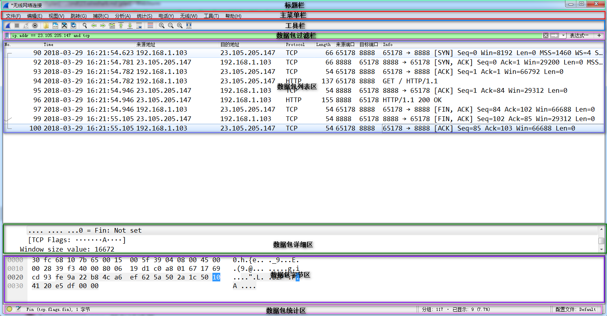

1\. wireshark有什么用 [#](#t01. wireshark有什么用)
------------------------------------------

1.  分析网络底层协议
2.  解决网络故障问题
3.  找寻网络安全问题

2\. 安装 [#](#t12. 安装)
--------------------

*   [download](https://www.wireshark.org/download.html)
*   [wiresharkbook](http://wiresharkbook.com/)

3\. 快速抓包 [#](#t23. 快速抓包)
------------------------

*   初始化界面
*   选择网卡
*   停止抓包
*   保存数据包

4\. 界面 [#](#t34. 界面)
--------------------

*   标题栏
*   主菜单栏
*   工具栏
*   数据包过滤栏
*   数据包列表区
*   数据包详细区
*   数据包字节区
*   数据包统计区

5\. 过滤器设置 [#](#t45. 过滤器设置)
--------------------------

### 5.1 抓包过滤器 [#](#t55.1 抓包过滤器)

#### 5.1.1 语法 [#](#t65.1.1 语法)

协议+方向+类型+值

*   HOST net port host
*   方向 src、dst、src and dst、src or dst
*   协议 ether ip tcp udp http ftp
*   逻辑运算符 && || !

#### 5.1.2 例子 [#](#t75.1.2 例子)

*   src host 192.168.1.1 && dst port 80 抓取来源地址为192.168.1.1，并且目的为80端口的流量
*   host 192.168.1.1|| host host 192.168.1.2 抓取192.168.1.1或192.168.1.2的流量
*   !broadcast 不抓取广播包

##### 5.1.2.1 过滤MAC [#](#t85.1.2.1 过滤MAC)

*   ether host 00:00:00:00:00:00 网卡主机
*   ether src host 00:00:00:00:00:00 来源MAC
*   ether dst host 00:00:00:00:00:00 目标MAC

##### 5.1.2.2 过滤IP [#](#t95.1.2.2 过滤IP)

*   host 192.168.1.1
*   src host 192.168.1.1
*   det host 192.168.1.1

##### 5.1.2.3 过滤端口 [#](#t105.1.2.3 过滤端口)

*   port 80
*   !port 80
*   dst port 80
*   src port 80

##### 5.1.2.4 过滤协议 [#](#t115.1.2.4 过滤协议)

*   arp
*   tcp

##### 5.1.2.5 综合过滤 [#](#t125.1.2.5 综合过滤)

*   host 192.168.1.100 && port 8080

### 5.2 显示过滤器 [#](#t135.2 显示过滤器)

显示过滤器：对捕捉到的数据包依据协议或包的内容进行过滤 

#### 5.2.1 语法 [#](#t145.2.1 语法)

*   比较操作符 == != \> < >= <=
*   逻辑操作符 and or xor(有且仅有一个条件被满足) not
*   IP地址 ip addr ip.src ip.dst
*   端口过滤 tcp.port tcp.srcport tcp.dstport tcp.flags.syn tcp.flag.ack
*   协议过滤 arp ip icmp udp tcp bootp dns

    #### 5.2.2 案例 [#](#t155.2.2 案例)

    ##### 5.2.2.1 过滤IP [#](#t165.2.2.1 过滤IP)

*   ip.addr == 192.168.0.1
*   ip.src == 192.168.0.1
*   ip.dst == 192.168.0.1
*   ip.src == 192.168.0.1 and ip.dst == 192.168.0.1

##### 5.2.2.2 过滤端口 [#](#t175.2.2.2 过滤端口)

*   tcp.port == 80
*   tcp.srcport == 80
*   tcp.dstport == 80
*   tcp.flags.sync == 1

##### 5.2.2.3 过滤协议 [#](#t185.2.2.3 过滤协议)

*   arp
*   tcp
*   udp
*   not http
*   not arp

##### 5.2.2.4 案例 [#](#t195.2.2.4 案例)

*   ip.src == 192.168.0.1 and tcp.dstport == 80
*   ip.addr == 192.168.0.1 and udp.port == 60000

6\. 三次握手 [#](#t206. 三次握手)
-------------------------

### 7\. Wireshark与对应的OSI七层模型 [#](#t217. Wireshark与对应的OSI七层模型)

### TCP包具体内容 [#](#t22TCP包具体内容)

### 8.参考 [#](#t238.参考)

*   [wireshark](https://www.cnblogs.com/TankXiao/archive/2012/10/10/2711777.html)

