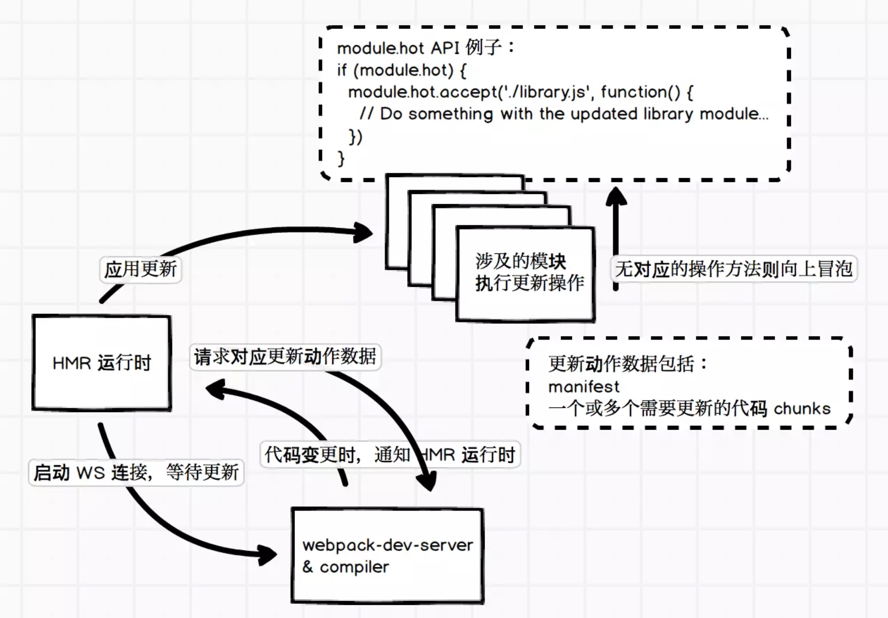

[[toc]]

# libraryTarget 和 library
--------------------------------------------------------------

当用 Webpack 去构建一个可以被其他模块导入使用的库时需要用到它们。

*   `output.libraryTarget` 配置以何种方式导出库
*   `output.library` 配置导出库的名称 output.libraryTarget 是字符串的枚举类型，支持以下配置

### 1.1 var (默认)

编写的库将通过`var`被赋值给通过`library`指定名称的变量。

#### 1.1.1 index.js [#](#t21.1.1 index.js)

```js
module.exports =  {
    add(a,b) {
        return a+b;
    }
}
```


#### 1.1.2 bundle.js [#](#t31.1.2 bundle.js)

```js
var calculator=(function (modules) {}({})
```


#### 1.1.3 index.html [#](#t41.1.3 index.html)

```html
    <script src="bundle.js"></script>
    <script>
        let ret = calculator.add(1,2);
        console.log(ret);
    </script>
```


### 1.2 commonjs [#](#t51.2 commonjs)

编写的库将通过 CommonJS 规范导出。

#### 1.2.1 导出方式 [#](#t61.2.1 导出方式)

```js
exports["calculator"] = (function (modules) {}({})
```


#### 1.2.2 使用方式 [#](#t71.2.2 使用方式)

```js
require('npm-name')['calculator'].add(1,2);
```


> npm-name是指模块发布到 Npm 代码仓库时的名称

### 1.3 commonjs2 [#](#t81.3 commonjs2)

编写的库将通过 CommonJS 规范导出。

#### 1.3.1 导出方式 [#](#t91.3.1 导出方式)

```js
module.exports = (function (modules) {}({})
```


#### 1.3.2 使用方式 [#](#t101.3.2 使用方式)

```js
require('npm-name').add();
```


> 在 output.libraryTarget 为 commonjs2 时，配置 output.library 将没有意义。

### 1.4 this [#](#t111.4 this)

编写的库将通过 this 被赋值给通过 library 指定的名称，输出和使用的代码如下：

#### 1.4.1 导出方式 [#](#t121.4.1 导出方式)

```js
this["calculator"]= (function (modules) {}({})
```


#### 1.4.2 使用方式 [#](#t131.4.2 使用方式)

```js
this.calculator.add();
```


### 1.5 window [#](#t141.5 window)

编写的库将通过 window 被赋值给通过 library 指定的名称，即把库挂载到 window 上，输出和使用的代码如下：

#### 1.5.1 导出方式 [#](#t151.5.1 导出方式)

```js
window["calculator"]= (function (modules) {}({})
```


#### 1.5.2 使用方式 [#](#t161.5.2 使用方式)

```js
window.calculator.add();
```


### 1.6 global [#](#t171.6 global)

编写的库将通过 global 被赋值给通过 library 指定的名称，即把库挂载到 global 上，输出和使用的代码如下：

#### 1.6.1 导出方式 [#](#t181.6.1 导出方式)

```js
global["calculator"] = (function (modules) {}({})
```


#### 1.6.2 使用方式 [#](#t191.6.2 使用方式)

```js
global.calculator.add();
```


2.DLL [#](#t202.DLL)
--------------------

`.dll`为后缀的文件称为动态链接库，在一个动态链接库中可以包含给其他模块调用的函数和数据

*   把基础模块独立出来打包到单独的动态连接库里
*   当需要导入的模块在动态连接库里的时候，模块不能再次被打包，而是去动态连接库里获取
*   [dll-plugin](https://webpack.js.org/plugins/dll-plugin/)

### 2.1 定义Dll [#](#t212.1 定义Dll)

*   DllPlugin插件： 用于打包出一个个动态连接库

*   DllReferencePlugin: 在配置文件中引入DllPlugin插件打包好的动态连接库

    ```js
    const path=require('path');
    const DllPlugin=require('webpack/lib/DllPlugin');
    module.exports={
        entry: {
            react:['react','react-dom']
        },// 把 React 相关模块的放到一个单独的动态链接库
        output: {
            path: path.resolve(__dirname,'dist'),// 输出的文件都放到 dist 目录下
            filename: '[name].dll.js',//输出的动态链接库的文件名称，[name] 代表当前动态链接库的名称
            library: '_dll_[name]',//存放动态链接库的全局变量名称,例如对应 react 来说就是 _dll_react
        },
        plugins: [
            new DllPlugin({
                // 动态链接库的全局变量名称，需要和 output.library 中保持一致
                // 该字段的值也就是输出的 manifest.json 文件 中 name 字段的值
                // 例如 react.manifest.json 中就有 "name": "_dll_react"
                name: '_dll_[name]',
                // 描述动态链接库的 manifest.json 文件输出时的文件名称
                path: path.join(__dirname, 'dist', '[name].manifest.json')
            })
        ]
    }

    webpack --config webpack.dll.config.js --mode development
    ```


### 2.2 使用动态链接库文件 [#](#t222.2 使用动态链接库文件)

```js
const DllReferencePlugin = require('webpack/lib/DllReferencePlugin')
plugins: [
  new DllReferencePlugin({
    manifest:require('./dist/react.manifest.json')
  })
]
```


```bash
webpack --config webpack.config.js --mode development
```


### 2.3 html中使用 [#](#t232.3 html中使用)

```html
<script src="react.dll.js"></script>
<script src="bundle.js"></script>
```


3\. HappyPack [#](#t243. HappyPack)
-----------------------------------

*   构建需要解析和处理文件,文件读写和计算密集型的操作太多后速度会很慢

*   Node.js 之上的 Webpack 是单线程模型

*   HappyPack就能让Webpack把任务分解给多个子进程去并发的执行，子进程处理完后再把结果发送给主进程。 [happypack](https://github.com/amireh/happypack)

    ```bash
    npm i happypack@next -D
    ```


    ```js
    const HappyPack = require('happypack');
        rules: [
        {
            test: /\.js$/,
            // 把对 .js 文件的处理转交给 id 为 babel 的 HappyPack 实例
            use: ['happypack/loader?id=babel'],
            exclude: path.resolve(__dirname, 'node_modules'),
        },
        {
            test: /\.css$/,
            // 把对 .css 文件的处理转交给 id 为 css 的 HappyPack 实例
            use: ['happypack/loader?id=css']
        }
    ]
    new HappyPack({
        //用唯一的标识符 id 来代表当前的 HappyPack 是用来处理一类特定的文件
        id: 'babel',
        // 如何处理 .js 文件，用法和 Loader 配置中一样
        use:[{
                loader: 'babel-loader',
                    options: {
                    presets:['env','stage-0','react']
                }
            }]
    }),
    new HappyPack({
        //用唯一的标识符 id 来代表当前的 HappyPack 是用来处理一类特定的文件
        id: 'css',
        // 如何处理 .css 文件，用法和 Loader 配置中一样
        use:['style-loader','css-loader'],
        threads: 4, //代表开启几个子进程去处理这一类型的文件
        verbose: true //是否允许输出日志
    })
    ```


4\. CDN [#](#t254. CDN)
-----------------------

CDN 又叫内容分发网络，通过把资源部署到世界各地，用户在访问时按照就近原则从离用户最近的服务器获取资源，从而加速资源的获取速度。

*   HTML文件不缓存，放在自己的服务器上，关闭自己服务器的缓存，静态资源的URL变成指向CDN服务器的地址

*   静态的JavaScript、CSS、图片等文件开启CDN和缓存，并且文件名带上HASH值

*   为了并行加载不阻塞，把不同的静态资源分配到不同的CDN服务器上

    ```js
    output: {
        path: path.resolve(__dirname, 'dist'),
        filename: '[name]_[hash:8].js',
        publicPath: 'http://img.zhangximufeng.cn'
    },
    ```

5.Tree Shaking [#](#t265.Tree Shaking)
--------------------------------------

`Tree Shaking` 可以用来剔除`JavaScript`中用不上的死代码。它依赖静态的`ES6`模块化语法，例如通过`import`和`export`导入导出。

### 5.1. 不要编译ES6模块 [#](#t275.1. 不要编译ES6模块)

```js
use:[{
  loader: 'babel-loader',
  options: {
 		 presets:[['env',{modules: false }],'stage-0','react']
  }
}]
```


### 5.2 显示未使用的导出实例 [#](#t285.2 显示未使用的导出实例)

```bash
npx webpack --display-used-exports
```


6.提取公共代码 [#](#t296.提取公共代码)
--------------------------

### 6.1 为什么需要提取公共代码 [#](#t306.1 为什么需要提取公共代码)

大网站有多个页面，每个页面由于采用相同技术栈和样式代码，会包含很多公共代码，如果都包含进来会有问题

*   相同的资源被重复的加载，浪费用户的流量和服务器的成本；
*   每个页面需要加载的资源太大，导致网页首屏加载缓慢，影响用户体验。 如果能把公共代码抽离成单独文件进行加载能进行优化，可以减少网络传输流量，降低服务器成本

### 6.2 如何提取 [#](#t316.2 如何提取)

*   基础类库，方便长期缓存
*   页面之间的公用代码
*   各个页面单独生成文件
*   [common-chunk-and-vendor-chunk](https://github.com/webpack/webpack/tree/master/examples/common-chunk-and-vendor-chunk)

### 6.3 提取公共代码 [#](#t326.3 提取公共代码)

```js
    entry: {
        pageA: './src/pageA',
        pageB: './src/pageB',
        pageC: './src/pageC'
    },
    output: {
        path: path.resolve(__dirname,'dist'),
        filename: '[name].js'
    },
    optimization: {
        splitChunks: {
            cacheGroups: {
                commons: {
                    chunks: "initial",
                    minChunks: 2,//最小重复的次数
                    minSize: 0//最小提取字节数
                },
                vendor: {
                    test: /node_modules/,
                    chunks: "initial",
                    name: "vendor",
                }
            }
        }
    }
```


7.开启 Scope Hoisting [#](#t337.开启 Scope Hoisting)
------------------------------------------------

Scope Hoisting 可以让 Webpack 打包出来的代码文件更小、运行的更快， 它又译作 "作用域提升"，是在 Webpack3 中新推出的功能。

*   代码体积更小，因为函数申明语句会产生大量代码
*   代码在运行时因为创建的函数作用域更少了，内存开销也随之变小

### 7.1 插件配置 [#](#t347.1 插件配置)

```js
const ModuleConcatenationPlugin = require('webpack/lib/optimize/ModuleConcatenationPlugin');
module.exports = {
  resolve: {
    // 针对 Npm 中的第三方模块优先采用 jsnext:main 中指向的 ES6 模块化语法的文件
    mainFields: ['jsnext:main', 'browser', 'main']
  },
  plugins: [
    // 开启 Scope Hoisting
    new ModuleConcatenationPlugin(),
  ],
};
```


### 7.2 代码 [#](#t357.2 代码)

hello.js

```js
export default 'Hello';
```


index.js

```js
import str from './hello.js';
console.log(str);
```


输出的结果main.js

```js
var n = name = "zxmf";
  console.log(n)
```


> 函数由两个变成了一个，hello.js 中定义的内容被直接注入到了 main.js 中

8.代码分离 [#](#t368.代码分离)
----------------------

*   代码分离是 webpack 中最引人注目的特性之一。
*   此特性能够把代码分离到不同的 bundle 中，然后可以按需加载或并行加载这些文件。 有三种常用的代码分离方法：
    *   入口起点：使用`entry`配置手动地分离代码。
    *   防止重复：使用`splitChunks`去重和分离`chunk`
    *   动态导入：通过模块的内联函数调用来分离代码。

### 8.1 多个入口 [#](#t378.1 多个入口)

```js
entry: {
  index: './src/index.js',
  another: './src/another-module.js'
}
```


### 8.2 防止重复 [#](#t388.2 防止重复)

splitChunks可以将公共的依赖模块提提取到一个新生成的 chunk. [common-chunk-and-vendor-chunk](https://github.com/webpack/webpack/tree/master/examples/common-chunk-and-vendor-chunk)

```js
optimization: {
 splitChunks: {
     cacheGroups: {
         commons: {
             chunks: "initial",
             minChunks: 2,
             minSize:0
         },
        vendor: {
             test: /node_modules/,
             chunks: "initial",
             name: "vendor",
         }
 }
}
```


### 8.3 动态导入和懒加载(dynamic imports) [#](#t398.3 动态导入和懒加载(dynamic imports))

用户当前需要用什么功能就只加载这个功能对应的代码，也就是所谓的按需加载 在给单页应用做按需加载优化时，一般采用以下原则：

*   对网站功能进行划分，每一类一个chunk
*   对于首次打开页面需要的功能直接加载，尽快展示给用户
*   某些依赖大量代码的功能点可以按需加载
*   被分割出去的代码需要一个按需加载的时机

#### 8.3.1 handler.js [#](#t408.3.1  handler.js)

```js
module.exports=function () {
    alert('你点我啦!');
}
```


#### 8.3.2 index.js [#](#t418.3.2 index.js)

```js
document.querySelector('#clickBtn').addEventListener('mouseover',() => {
    import('./handler').then(clickMe => {
        window.clickMe=clickMe.default;
    });
});
```


#### 8.3.3 html [#](#t428.3.3 html)

```html
<div id="clickBtn" onclick="clickMe()">弹框</div>
```


### 8.4 react-router4 路由懒加载 [#](#t438.4 react-router4 路由懒加载)

#### 8.4.1 index.js [#](#t448.4.1 index.js)

```jsx
import React from 'react';
import ReactDOM from 'react-dom';
import {HashRouter as Router,Route} from 'react-router-dom';
import Bundle from './Bundle';
let LazyAbout=(props) => (<Bundle {...props} load={()=>import('./About')}/>)
let Home=() => <div>Home</div>
ReactDOM.render(
<Router>
    <div>
      <Route path="/" component={Home} />
      <Route path="/about" component={LazyAbout}/>
    </div>
</Router>,document.getElementById('root'));
```


#### 8.4.2 Bundle [#](#t458.4.2 Bundle)

```jsx
import React from 'react';
export default class Bundle extends React.Component{
    state={Mod: null}
    componentWillMount() {
        this.props.load().then(mod=>this.setState({Mod: mod.default? mod.default:mod}));
    }
    render() {
        let Mod=this.state.Mod;
        return Mod && <Mod  {...this.props}/>;
    }
}
```


#### 8.4.2 Bundle [#](#t468.4.2 Bundle)

```jsx
import React from 'react';
export default props => <div>About</div>
```


9.用 HMR 提高开发效率 [#](#t479.用 HMR 提高开发效率)
--------------------------------------

*   HMR 全称是 Hot Module Replacement，即模块热替换

*   Hot Reloading，当代码变更时通知浏览器刷新页面，以避免频繁手动刷新浏览器页面

*   HMR 可以理解为增强版的 Hot Reloading，但不用整个页面刷新，而是局部替换掉部分模块代码并且使其生效

    

webpack.config.js

```js
const webpack = require('webpack')
module.exports = {
  devServer: {
    hot: true // dev server 的配置要启动 hot，或者在命令行中带参数开启
  },
  plugins: [
    new webpack.NamedModulesPlugin(), // 用于启动 HMR 时可以显示模块的相对路径
    new webpack.HotModuleReplacementPlugin(), // Hot Module Replacement 的插件
  ],
}
```


hello.js

```js
module.exports = function () {
    console.log('hello');
}
```


```js
let hello = require('./hello');
hello();
if (module.hot) {
    module.hot.accept('./hello', function() {
        let hello = require('./hello');
        hello();
    })
}
```


9\. 输出分析 [#](#t489. 输出分析)
-------------------------

    webpack --profile --json > stats.json


*   profile：记录下构建过程中的耗时信息；
*   json：以 JSON 的格式输出构建结果，最后只输出一个 .json 文件，这个文件中包括所有构建相关的信息。

*   Webpack 官方提供了一个可视化分析工具 [Webpack Analyse](https://webpack.github.io/analyse)

*   Modules：展示所有的模块，每个模块对应一个文件。并且还包含所有模块之间的依赖关系图、模块路径、模块ID、模块所属 Chunk、模块大小；

*   Chunks：展示所有的代码块，一个代码块中包含多个模块。并且还包含代码块的ID、名称、大小、每个代码块包含的模块数量，以及代码块之间的依赖关系图；
*   Assets：展示所有输出的文件资源，包括 .js、.css、图片等。并且还包括文件名称、大小、该文件来自哪个代码块；
*   Warnings：展示构建过程中出现的所有警告信息；
*   Errors：展示构建过程中出现的所有错误信息；
*   Hints：展示处理每个模块的过程中的耗时。

