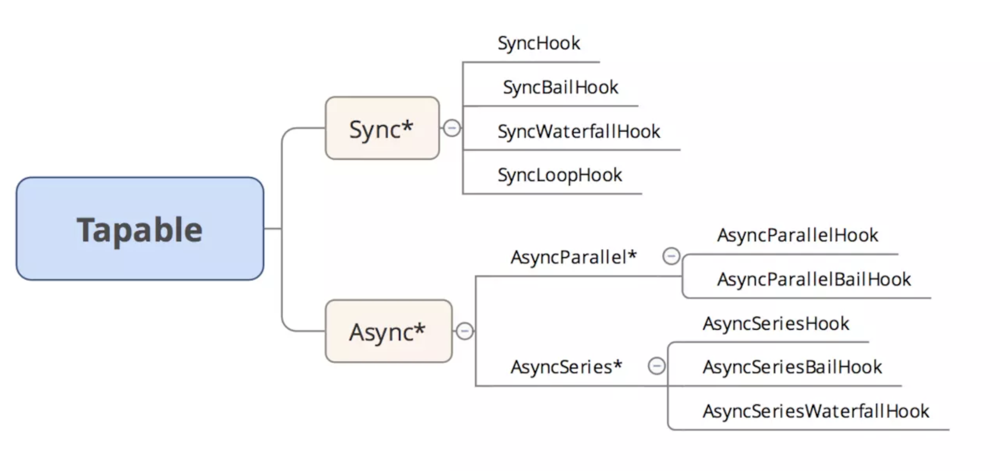

1\. tapable [#](#t01. tapable)
------------------------------

webpack本质上是一种事件流的机制，它的工作流程就是将各个插件串联起来，而实现这一切的核心就是Tapable，webpack中最核心的负责编译的Compiler和负责创建bundles的Compilation都是Tapable的实例

2.tapable用法 [#](#t12.tapable用法)
-------------------------------

```js
const {
    SyncHook,
    SyncBailHook,
    SyncWaterfallHook,
    SyncLoopHook,
    AsyncParallelHook,
    AsyncParallelBailHook,
    AsyncSeriesHook,
    AsyncSeriesBailHook,
    AsyncSeriesWaterfallHook
 } = require("tapable");
```




3.Sync*类型的钩子 
---------------------------------

*   注册在该钩子下面的插件的执行顺序都是顺序执行。
*   只能使用`tap`注册，不能使用`tapPromise`和`tapAsync`注册

    ### 3.1 SyncHook [#](#t33.1 SyncHook)

    串行同步执行,不关心返回值

    ```js
    //let {SyncHook}=require('tapable');
    class SyncHook{
      constructor() {
          this.tasks=[];
      }
      tap(name,task) {
          this.tasks.push(task);
      }
      call() {
          this.tasks.forEach(task=>task(...arguments));
      }
    }
    let queue = new SyncHook(['name']);
    queue.tap('1',function(name){
    console.log(name,1);
    });
    queue.tap('2',function(name){
    console.log(name,2);
    });
    queue.tap('3',function(name){
    console.log(name,3);
    });
    queue.call('zxmf');
    ```


    ### 3.2 SyncBailHook [#](#t43.2 SyncBailHook)
    
    串行同步执行，有一个返回值不为null则跳过剩下的逻辑
    
    ```js
    //let {SyncBailHook}=require('tapable');
    class SyncBailHook{
      constructor() {
          this.tasks=[];
      }
      tap(name,task) {
          this.tasks.push(task);
      }
      call() {
          // for (let i=0;i<this.tasks.length;i++){
          //     let ret=this.tasks[i](...arguments);
          //     if (ret)
          //         break;
          // }
          let i=0,ret;
          do {
              ret=this.tasks[i++](...arguments);
          } while (!ret);
      }
    }
    let queue = new SyncBailHook(['name']);
    queue.tap('1',function(name){
    console.log(name,1);
    return 'Wrong';
    });
    queue.tap('2',function(name){
    console.log(name,2);
    });
    queue.tap('3',function(name){
    console.log(name,3);
    });
    queue.call('zxmf');
    ```


​    

### 3.3 SyncWaterfallHook [#](#t53.3 SyncWaterfallHook)

```js
class SyncWaterfallHook{
    constructor() {
        this.tasks=[];
    }
    tap(name,task) {
        this.tasks.push(task);
    }
    call() {
        let [first,...tasks]=this.tasks;
        tasks.reduce((ret,task)=>task(ret),first(...arguments));
    }
}
let queue = new SyncWaterfallHook(['name']);
queue.tap('1',function(name,age){
  console.log(name,age,1);
  return 1;
});
queue.tap('2',function(data){
    console.log(data,2);
    return 2;
});
queue.tap('3',function(data){
  console.log(data,3);
});
queue.call('zxmf',9);
```


### 3.4 SyncLoopHook [#](#t63.4 SyncLoopHook)

监听函数返回true表示继续循环，返回undefine表示结束循环

```js
//let {SyncHook}=require('tapable');
class SyncLoopHook{
    constructor() {
        this.tasks=[];
    }
    tap(name,task) {
        this.tasks.push(task);
    }
    call(...args) {    
        this.tasks.forEach(task => {
            let ret=true;
            do {
                ret = task(...args);
            }while(ret)
        });
    }
}
let queue = new SyncLoopHook(['name']);
let count = 0;
queue.tap('1',function(name){
    console.log(count++);
    if(count==3){
        return;
    }else{
        return true;
    }
});
queue.call('zxmf');
```


4\. Async*类型的钩子 
--------------------------------------

*   支持tap、tapPromise、tapAsync注册
*   每次都是调用tap、tapSync、tapPromise注册不同类型的插件钩子，通过调用call、callAsync 、promise方式调用。其实调用的时候为了按照一定的执行策略执行，调用compile方法快速编译出一个方法来执行这些插件。

### 4.1 AsyncParallel [#](#t84.1 AsyncParallel)

#### 4.1.1 AsyncParallelHook [#](#t94.1.1 AsyncParallelHook)

tap

```js
let {AsyncParallelHook}=require('tapable');
class AsyncParallelHook1{
    constructor() {
        this.tasks=[];
    }
    tap(name,task) {
        this.tasks.push(task);
    }
    callAsync() {
        this.tasks.forEach(task => task(...arguments));
        Array.from(arguments).pop()();
    }
}
let queue = new AsyncParallelHook(['name']);
console.time('cost');
queue.tap('1',function(name){
    console.log(1);
});
queue.tap('2',function(name){
    console.log(2);
});
queue.tap('3',function(name){
    console.log(3);
});
queue.callAsync('zxmf',err=>{
    console.log(err);
    console.timeEnd('cost');
});
```


tapAsync

```js
//let {AsyncParallelHook}=require('tapable');
class AsyncParallelHook{
    constructor() {
        this.tasks=[];
    }
    tapAsync(name,task) {
        this.tasks.push(task);
    }
    callAsync() {
        let args=Array.from(arguments);
        let callback=args.pop();
        let i=0,size = this.tasks.length;
        function done() {
            if (++i == size) {
                callback(null);
            }
        }
        this.tasks.forEach(task => {
            task(...args,done);
        });
    }
}
let queue = new AsyncParallelHook(['name']);
console.time('cost');
queue.tapAsync('1',function(name,callback){
    setTimeout(function(){
        console.log(1);
        callback();
    },1000)
});
queue.tapAsync('2',function(name,callback){
    setTimeout(function(){
        console.log(2);
        callback();
    },2000)
});
queue.tapAsync('3',function(name,callback){
    setTimeout(function(){
        console.log(3);
        callback();
    },3000)
});
queue.callAsync('zxmf',err=>{
    console.log(err);
    console.timeEnd('cost');
});
```


tapPromise

```js
//let {AsyncParallelHook}=require('tapable');
class AsyncParallelHook{
    constructor() {
        this.tasks=[];
    }
    tapPromise(name,task) {
        this.tasks.push(task);
    }
    promise() {
        let args=Array.from(arguments);
        let callback=args.pop();
        let promises = this.tasks.map(task => task());
        return Promise.all(promises);
    }
}
let queue = new AsyncParallelHook(['name']);
console.time('cost');
queue.tapPromise('1',function(name){
    return new Promise(function(resolve,reject){
        setTimeout(function(){
            console.log(1);
            resolve();
        },1000)
    });

});
queue.tapPromise('2',function(name){
    return new Promise(function(resolve,reject){
        setTimeout(function(){
            console.log(2);
            resolve();
        },2000)
    });
});
queue.tapPromise('3',function(name){
    return new Promise(function(resolve,reject){
        setTimeout(function(){
            console.log(3);
            resolve();
        },3000)
    });
});
queue.promise('zxmf').then(()=>{
    console.timeEnd('cost');
})
```


#### 4.1.2 AsyncParallelBailHook [#](#t104.1.2 AsyncParallelBailHook)

```js
let {AsyncParallelBailHook} = require('tapable');
let queue = new AsyncParallelBailHook(['name']);
console.time('cost');
queue.tap('1',function(name){
    console.log(1);
    return "Wrong";
});
queue.tap('2',function(name){
    console.log(2);
});
queue.tap('3',function(name){
    console.log(3);
});
queue.callAsync('zxmf',err=>{
    console.log(err);
    console.timeEnd('cost');
});
```


### 4.2 AsyncSeries [#](#t114.2 AsyncSeries)

#### 4.2.1 AsyncSeriesHook [#](#t124.2.1 AsyncSeriesHook)

tap

```js
let {AsyncSeriesHook} = require('tapable');
let queue = new AsyncSeriesHook(['name']);
console.time('cost');
queue.tap('1',function(name){
    console.log(1);
    return "Wrong";
});
queue.tap('2',function(name){
    console.log(2);
});
queue.tap('3',function(name){
    console.log(3);
});
queue.callAsync('zxmf',err=>{
    console.log(err);
    console.timeEnd('cost');
});
```


tapAsync

```js
//let {AsyncParallelBailHook}=require('tapable');
class AsyncParallelBailHook{
    constructor() {
        this.tasks=[];
    }
    tap(name,task) {
        this.tasks.push(task);
    }
    callAsync() {
        let args=Array.from(arguments);
        let callback=args.pop();
        let i=0,size = this.tasks.length;
        function done() {
            if (++i == size) {
                callback(null);
            }
        }
        for (let i=0;i<this.tasks.length;i++){
            let ret=this.tasks[i](...args,done);
            if (ret) break;
        }
    }
}
let queue = new AsyncParallelBailHook(['name']);
console.time('cost');
queue.tap('1',function(name){
    console.log(1);
    return "Wrong";
});
queue.tap('2',function(name){
    console.log(2);
});
queue.tap('3',function(name){
    console.log(3);
});
queue.callAsync('zxmf',err=>{
    console.log(err);
    console.timeEnd('cost');
});
```


tapPromise

```js
let {AsyncSeriesHook} = require('tapable');
let queue = new AsyncSeriesHook(['name']);
console.time('cost');
queue.tapPromise('1',function(name){
   return new Promise(function(resolve){
       setTimeout(function(){
           console.log(1);
           resolve();
       },1000)
   });
});
queue.tapPromise('2',function(name,callback){
    return new Promise(function(resolve){
        setTimeout(function(){
            console.log(2);
            resolve();
        },2000)
    });
});
queue.tapPromise('3',function(name,callback){
    return new Promise(function(resolve){
        setTimeout(function(){
            console.log(3);
            resolve();
        },3000)
    });
});
queue.promise('zxmf').then(err=>{
    console.log(err);
    console.timeEnd('cost');
});
```


#### 4.2.2 AsyncSeriesBailHook [#](#t134.2.2 AsyncSeriesBailHook)

tap

```js
let {AsyncSeriesBailHook} = require('tapable');
let queue = new AsyncSeriesBailHook(['name']);
console.time('cost');
queue.tap('1',function(name){
    console.log(1);
    return "Wrong";
});
queue.tap('2',function(name){
    console.log(2);
});
queue.tap('3',function(name){
    console.log(3);
});
queue.callAsync('zxmf',err=>{
    console.log(err);
    console.timeEnd('cost');
});
```


tabAsync

```js
//let {AsyncSeriesBailHook}=require('tapable');
class AsyncSeriesBailHook{
    constructor() {
        this.tasks=[];
    }
    tapAsync(name,task) {
        this.tasks.push(task);
    }
    callAsync() {
        let args=Array.from(arguments);
        let callback=args.pop();
        let i=0,size = this.tasks.length;
        let next=(err) => {
            if (err) return  callback(err);
            let task=this.tasks[i++];
            task?task(...args,next):callback();
        }
        next();
    }
}
let queue = new AsyncSeriesBailHook(['name']);
console.time('cost');
queue.tapAsync('1',function(name,callback){
   setTimeout(function(){
       console.log(1);
       callback('wrong');
   },1000)
});
queue.tapAsync('2',function(name,callback){
    setTimeout(function(){
        console.log(2);
        callback();
    },2000)
});
queue.tapAsync('3',function(name,callback){
    setTimeout(function(){
        console.log(3);
        callback();
    },3000)
});
queue.callAsync('zxmf',err=>{
    console.log(err);
    console.timeEnd('cost');
});
```


tapPromise

```js
let {AsyncSeriesBailHook} = require('tapable');
let queue = new AsyncSeriesBailHook(['name']);
console.time('cost');
queue.tapPromise('1',function(name){
   return new Promise(function(resolve,reject){
       setTimeout(function(){
           console.log(1);
           //resolve();
           reject();
       },1000)
   });
});
queue.tapPromise('2',function(name,callback){
    return new Promise(function(resolve){
        setTimeout(function(){
            console.log(2);
            resolve();
        },2000)
    });
});
queue.tapPromise('3',function(name,callback){
    return new Promise(function(resolve){
        setTimeout(function(){
            console.log(3);
            resolve();
        },3000)
    });
});
queue.promise('zxmf').then(err=>{
    console.log(err);
    console.timeEnd('cost');
},err=>{
    console.log(err);
    console.timeEnd('cost');
});
```


#### 4.2.3 AsyncSeriesWaterfallHook [#](#t144.2.3 AsyncSeriesWaterfallHook)

tap

```js
let {AsyncSeriesWaterfallHook} = require('tapable');
let queue = new AsyncSeriesWaterfallHook(['name']);
console.time('cost');
queue.tap('1',function(name,callback){
    console.log(1);
});
queue.tap('2',function(data){
    console.log(2,data);
});
queue.tap('3',function(data){
    console.log(3,data);
});
queue.callAsync('zxmf',err=>{
    console.log(err);
    console.timeEnd('cost');
});
```


tapAsync

```js
//let {AsyncSeriesBailHook}=require('tapable');
class AsyncSeriesWaterfallHook{
    constructor() {
        this.tasks=[];
    }
    tapAsync(name,task) {
        this.tasks.push(task);
    }
    callAsync() {
        let args=Array.from(arguments);
        let callback=args.pop();
        let i=0,size = this.tasks.length;
        let next=(err,data) => {
            if (err) return  callback(err);
            let task=this.tasks[i++];
            if (task) {
                if (i==0) {
                    task(...args,next);
                } else {
                    task(data,next);
                }

            } else {
                callback(err,data);
            }
        }
        next();
    }
}
let queue = new AsyncSeriesWaterfallHook(['name']);
console.time('cost');
queue.tapAsync('1',function(name,callback){
   setTimeout(function(){
       console.log(1);
       callback(null,1);
   },1000)
});
queue.tapAsync('2',function(data,callback){
    setTimeout(function(){
        console.log(2);
        callback(null,2);
    },2000)
});
queue.tapAsync('3',function(data,callback){
    setTimeout(function(){
        console.log(3);
        callback(null,3);
    },3000)
});
queue.callAsync('zxmf',(err,data)=>{
    console.log(err,data);
    console.timeEnd('cost');
});
```


tapPromise

```js
let {AsyncSeriesHook} = require('tapable');
let queue = new AsyncSeriesHook(['name']);
console.time('cost');
queue.tapPromise('1',function(name){
   return new Promise(function(resolve,reject){
       setTimeout(function(){
           console.log(1);
           //resolve();
           reject();
       },1000)
   });
});
queue.tapPromise('2',function(name,callback){
    return new Promise(function(resolve){
        setTimeout(function(){
            console.log(2);
            resolve();
        },2000)
    });
});
queue.tapPromise('3',function(name,callback){
    return new Promise(function(resolve){
        setTimeout(function(){
            console.log(3);
            resolve();
        },3000)
    });
});
queue.promise('zxmf').then(err=>{
    console.log(err);
    console.timeEnd('cost');
},err=>{
    console.log(err);
    console.timeEnd('cost');
});
```


4.tapable [#](#t154.tapable)
----------------------------

```js
const {Tapable,SyncHook} = require("tapable");
const t = new Tapable();
t.hooks = {
    myHook: new SyncHook()
};
let called = 0;
t.plugin("my-hook", () => called++);
t.hooks.myHook.call();
t.plugin("my-hook", () => called += 10);
t.hooks.myHook.call();
console.log(called);
```


