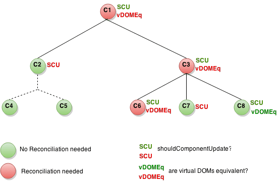

[[toc]]

# React生命周期
----------------------------------

```jsx
class Counter extends React.Component{ // 他会比较两个状态相等就不会刷新视图 PureComponent是浅比较
  static defaultProps = {
    name:'沐枫'
  };
  constructor(props){
    super();
    this.state = {number:0}
    console.log('1.constructor构造函数')
  }
  componentWillMount(){ // 取本地的数据 同步的方式：采用渲染之前获取数据，只渲染一次
    console.log('2.组件将要加载 componentWillMount');
  }
  componentDidMount(){
    console.log('4.组件挂载完成 componentDidMount');
  }
  handleClick=()=>{
    this.setState({number:this.state.number+1});
  };
  // react可以shouldComponentUpdate方法中优化 PureComponent 可以帮我们做这件事
  shouldComponentUpdate(nextProps,nextState){ // 代表的是下一次的属性 和 下一次的状态
    console.log('5.组件是否更新 shouldComponentUpdate');
    return nextState.number%2;
    // return nextState.number!==this.state.number; //如果此函数种返回了false 就不会调用render方法了
  } //不要随便用setState 可能会死循环
  componentWillUpdate(){
    console.log('6.组件将要更新 componentWillUpdate');
  }
  componentDidUpdate(){
    console.log('7.组件完成更新 componentDidUpdate');
  }
  render(){
    console.log('3.render');
    return (
      <div>
        <p>{this.state.number}</p>
        {this.state.number>3?null:<ChildCounter n={this.state.number}/>}
        <button onClick={this.handleClick}>+</button>
      </div>
    )
  }
}
class ChildCounter extends Component{
  componentWillUnmount(){
    console.log('组件将要卸载componentWillUnmount')
  }
  componentWillMount(){
    console.log('child componentWillMount')
  }
  render(){
    console.log('child-render')
    return (<div>
      {this.props.n}
    </div>)
  }
  componentDidMount(){
    console.log('child componentDidMount')
  }
  componentWillReceiveProps(newProps){ // 第一次不会执行，之后属性更新时才会执行
    console.log('child componentWillReceiveProps')
  }
  shouldComponentUpdate(nextProps,nextState){
    return nextProps.n%3; //子组件判断接收的属性 是否满足更新条件 为true则更新
  }
}
// defaultProps
// constructor
// componentWillMount
// render
// componentDidMount
// 状态更新会触发的
// shouldComponentUpdate nextProps,nextState=>boolean
// componentWillUpdate
// componentDidUpdate
// 属性更新
// componentWillReceiveProps newProps
// 卸载
// componentWillUnmount
```


2\. 使用 PropTypes 进行类型检查 [#](#t12. 使用 PropTypes 进行类型检查)
------------------------------------------------------

React 内置了类型检测的功能。要在组件中进行类型检测，你可以赋值 propTypes 属性

*   .array 数组

*   .bool 布尔值

*   .func 函数

*   .number 数字

*   .object 对象

*   .string 字符串

*   .symbol 符号

*   .node 任何东西都可以被渲染:numbers, strings, elements,或者是包含这些类型的数组(或者是片段)。

*   .element React元素

*   .instanceOf(Message) 类的一个实例

*   .oneOf(\['News', 'Photos'\]) 枚举值

*   .oneOfType(\[PropTypes.string,PropTypes.number,PropTypes.instanceOf(Message)\]) 多种类型其中之一

*   .arrayOf(PropTypes.number) 某种类型的数组

*   .objectOf(PropTypes.number) 某种类型的对象

*   .shape({color: PropTypes.string,fontSize: PropTypes.number}) 特定形式的对象

*   .func.isRequired 可以使用 `isRequired' 链接上述任何一个，以确保在没有提供 prop 的情况下显示警告

*   .any.isRequired 任何数据类型的值

*   function(props, propName, componentName) { return new Error()} 自定义的验证器

*   .arrayOf(function(propValue, key, componentName, location, propFullName) {}

    ```jsx
    import React from 'react';
    import ReactDOM from 'react-dom';
    import PropTypes from 'prop-types';
    class Person extends React.Component{
      static defaultProps = {
        name:'Stranger'
      }
        static propTypes={
            name: PropTypes.string.isRequired,
            age: PropTypes.number.isRequired,
            gender: PropTypes.oneOf(['male','famale']),
            hobby: PropTypes.array,
            postion: PropTypes.shape({
                x: PropTypes.number,
                y:PropTypes.number
            }),
            age(props,propName,componentName) {
                let age=props[propName];
                if (age <0 || age>120) {
                    return new Error(`Invalid Prop ${propName} supplied to ${componentName}`)
                }
            }
        }
        render() {
            let {name,age,gender,hobby,position}=this.props;
            return (
                <table>
                    <thead>
                    <tr>
                        <td>姓名</td>
                        <td>年龄</td>
                        <td>性别</td>
                        <td>爱好</td>
                        <td>位置</td>
                    </tr>
                    </thead>
                    <tbody>
                    <tr>
                        <td>{name}</td>
                        <td>{age}</td>
                        <td>{gender}</td>
                        <td>{hobby.join(',')}</td>
                        <td>{position.x+' '+position.y}</td>
                    </tr>
                    </tbody>
                </table>
            )
        }
    }
    let person={
        age: 100,
        gender:'male',
        hobby: ['basketball','football'],
        position: {x: 10,y: 10},
    }
    ReactDOM.render(<Person {...person}/>, document.getElementById('root'));
    ```

3\. 优化性能 [#](#t23. 优化性能)
------------------------

在内部，React使用几种巧妙的技术来最大限度地减少更新UI所需的昂贵的 DOM 操作的数量

### 3.1 使用生产版本 [#](#t33.1 使用生产版本)

*   最好在开发应用时使用开发模式，部署应用时换为生产模式

**Create React App**

    npm run build


**单文件构建**

```html
<script src="https://unpkg.com/react@15/dist/react.min.js"></script>
<script src="https://unpkg.com/react-dom@15/dist/react-dom.min.js"></script>
```


**webpack**

```js
new webpack.DefinePlugin({
  'process.env': {
    NODE_ENV: JSON.stringify('production')
  }
}),
new webpack.optimize.UglifyJsPlugin()
```


### 4\. 使用 Chrome 性能分析工具 分析组件性能 [#](#t44. 使用 Chrome 性能分析工具 分析组件性能)

1.  通过添加 ?react_perf 查询字段加载你的应用(例如：[http://localhost:3000/?react_perf)。](http://localhost:3000/?react_perf)。)
2.  打开 Chrome DevTools Performance 并点击 Record 。[timeline-tool](https://developers.google.com/web/tools/chrome-devtools/evaluate-performance/reference)
3.  执行你想要分析的操作，不要超过20秒，否则 Chrome 可能会挂起。
4.  停止记录。
5.  在 User Timing 标签下，React事件将会分组列出。[react-16](https://building.calibreapp.com/debugging-react-performance-with-react-16-and-chrome-devtools-c90698a522ad)

### 5\. 避免重新渲染 [#](#t55. 避免重新渲染)

*   React 构建并维护渲染 UI 的内部表示

*   当组件的 props 和 state 改变时，React 通过比较新返回的元素 和 之前渲染的元素 来决定是否有必要更新DOM元素。当二者不相等时，则更新 DOM 元素

    

### 5.1 shouldComponentUpdate [#](#t65.1 shouldComponentUpdate)
### 5.2 React.PureComponent 与 React.Component 完全相同，但是在shouldComponentUpdate()中实现时，使用了 props 和 state 的浅比较

### 5.3 使用 Immutable 数据结构 [#](#t85.3 使用 Immutable 数据结构)

*   不可变(Immutable): 一个集合一旦创建，在其他时间是不可更改的。
*   持久的(Persistent): 新的集合可以基于之前的结合创建并产生突变，例如：set。原来的集合在新集合创建之后仍然是可用的。
*   结构共享(Structural Sharing): 新的集合尽可能通过之前集合相同的结构创建，最小程度地减少复制操作来提高性能。

    ```js
    import { is } from 'immutable';
    shouldComponentUpdate: (nextProps, nextState) => {
    return !(this.props === nextProps || is(this.props, nextProps)) ||
           !(this.state === nextState || is(this.state, nextState));
    }
    ```


    改进setState

    ```js
    this.setState({ data: this.state.data.update('counter', counter => counter + 1) });
    ```


​

6\. Reconciliation [#](#t96. Reconciliation)
--------------------------------------------

[reconciliation](http://www.css88.com/react/docs/reconciliation.html)

当比较不同的两个树，React 首先比较两个根元素。根据根跟的类型不同，它有不同的行为

*   当根元素类型不同时，React 将会销毁原先的树并重写构建新的树
*   当比较两个相同类型的 React DOM 元素时，React 检查它们的属性（attributes），保留相同的底层 DOM 节点，只更新发生改变的属性（attributes）
*   当一个组件更新的时候，组件实例保持不变，以便在渲染中保持state。React会更新组件实例的属性来匹配新的元素，并在元素实例上调用 componentWillReceiveProps() 和 componentWillUpdate()
*   Keys

7\. 上下文(Context)
-----------------------------------------

在某些场景下，你想在整个组件树中传递数据，但却不想手动地在每一层传递属性。你可以直接在 React 中使用强大的”context” API解决上述问题

```jsx
import React,{Component} from 'react';
import ReactDOM from 'react-dom';
import PropTypes from 'prop-types';
class Header extends Component{
    render() {
        return (
            <div>
                <Title/>
            </div>
        )
    }
}
class Title extends Component{
    static contextTypes={
        color:PropTypes.string
    }
    render() {
        return (
            <div style={{color:this.context.color}}>
                Title
            </div>
        )
    }
}
class Main extends Component{
    render() {
        return (
            <div>
                <Content>
                </Content>
            </div>
        )
    }
}
class Content extends Component{
    static contextTypes={
        color: PropTypes.string,
        changeColor:PropTypes.func
    }
    render() {
        return (
            <div style={{color:this.context.color}}>
                Content
                <button onClick={()=>this.context.changeColor('green')}>绿色</button>
                <button onClick={()=>this.context.changeColor('orange')}>橙色</button>
            </div>
        )
    }
}
class Page extends Component{
    constructor() {
        super();
        this.state={color:'red'};
    }
    static childContextTypes={
        color: PropTypes.string,
        changeColor:PropTypes.func
    }
    getChildContext() {
        return {
            color: this.state.color,
            changeColor:(color)=>{
                this.setState({color})
            }
        }
    }
    render() {
        return (
            <div>
                <Header/>
                <Main/>
            </div>
        )
    }
}
ReactDOM.render(<Page/>,document.querySelector('#root'));
```


8\. 片段(fragments) [#](#t118. 片段(fragments))
-------------------------------------------

React 中一个常见模式是为一个组件返回多个元素。 片段(fragments) 可以让你将子元素列表添加到一个分组中，并且不会在DOM中增加额外节点。

```jsx
import React from 'react';
import ReactDOM from 'react-dom';

class List extends React.Component{
    render() {
        return (
            <React.Fragment>
            {
                this.props.todos.map(item => (<li>{item}</li>))
            }
           </React.Fragment>
        )
    }
}
class Todos extends React.Component{
    constructor() {
        super();
        this.state={todos:['a','b','c']};
    }
    render() {
        return (
            <ul>
                <List todos={this.state.todos}/>
            </ul>
        )
    }
}

ReactDOM.render(<Todos/>,document.querySelector('#root'));
```


9\. 插槽(Portals) [#](#t129. 插槽(Portals))
---------------------------------------

Portals 提供了一种很好的方法，将子节点渲染到父组件 DOM 层次结构之外的 DOM 节点。

    ReactDOM.createPortal(child, container)


*   第一个参数（child）是任何可渲染的 React 子元素，例如一个元素，字符串或 片段(fragment)

*   第二个参数（container）则是一个 DOM 元素

    ```jsx
    import React,{Component} from 'react';
    import ReactDOM from 'react-dom';
    import './modal.css';

    class Modal extends Component{
        constructor() {
            super();
            this.modal=document.querySelector('#modal-root');
        }
        render() {
            return ReactDOM.createPortal(this.props.children,this.modal);
        }
    }
    class Page extends Component{
        constructor() {
            super();
            this.state={show:false};
        }
        handleClick=() => {
            this.setState({show:!this.state.show});
        }
        render() {
            return (
                <div>
                    <button onClick={this.handleClick}>显示模态窗口</button>
                    {
                        this.state.show&&<Modal>
                        <div id="modal" className="modal">
                            <div className="modal-content" id="modal-content">
                                    内容
                                    <button onClick={this.handleClick}>关闭</button>
                            </div>
                        </div>
                    </Modal>
                    }
                </div>
            )
        }
    }
    ReactDOM.render(<Page/>,document.querySelector('#root'));

    ```

    ```scss
    .modal{
        position: fixed;
        left:0;
        top:0;
        right:0;
        bottom:0;
        background: rgba(0,0,0,.5);
        display: block;
    }

    @keyframes zoom{
        from{transform:scale(0);}
        to{transform:scale(1);}
    }

    .modal .modal-content{
        width:50%;
        height:50%;
        background: white;
        border-radius: 10px;
        margin:100px auto;
        display:flex;
        flex-direction: row;
        justify-content: center;
        align-items: center;
        animation: zoom .6s;
    }
    ```


10\. 错误边界(Error Boundaries) [#](#t1310. 错误边界(Error Boundaries))
---------------------------------------------------------------

部分 UI 中的 JavaScript 错误不应该破坏整个应用程序。 为了解决 React 用户的这个问题，React 16引入了一个 “错误边界(Error Boundaries)” 的新概念。

```jsx
import React from 'react';
import ReactDOM from 'react-dom';
class ErrorBoundary extends React.Component{
    constructor(props) {
        super(props);
        this.state={hasError:false};
    }
    componentDidCatch(err,info) {
        this.setState({hasError: true});
    }
    render() {
        if (this.state.hasError) {
            return <h1>Something Went Wrong</h1>
        }
        return this.props.children;
    }
}

class Page extends React.Component{
    render() {
        return (
            <ErrorBoundary>
                <Clock/>
            </ErrorBoundary>
        )
    }
}
class Clock extends React.Component{
    render() {
        return (
            <div>hello{null.toString()}</div>
        )
    }
}

ReactDOM.render(<Page/>,document.querySelector('#root'));
```


11\. 高阶组件(Higher-Order Components) [#](#t1411. 高阶组件(Higher-Order Components))
-----------------------------------------------------------------------------

```jsx
const NewComponent = higherOrderComponent(OldComponent)
```


```jsx
import React,{Component} from 'react';
import ReactDOM from 'react-dom';

export default (WrappedComponent,name) => {
    class HighOrderComponent extends Component{
        constructor() {
            super();
            this.state={data:null};
        }

        componentWillMount() {
            let data=localStorage.getItem(name);
            this.setState({data});
        }

        render() {
            return <WrappedComponent data={this.state.data}/>
        }
    }
    return HighOrderComponent;
}
```


```jsx
import React,{Component} from 'react';
import ReactDOM from 'react-dom';
import wrapLocalData from './wrapLocalData';
let UserName=(props) => {
    return <input type="text" defaultValue={props.data}/>
}
let Password=(props) => {
    return <input type="text" defaultValue={props.data}/>
}
let NewUserName=wrapLocalData(UserName,'username');
let NewPassword=wrapLocalData(Password,'password');
class Form extends Component{
    render() {
        return (
            <form>
                <NewUserName />
                <NewPassword/>
            </form>
        )
    }
}
ReactDOM.render(<Form/>,document.querySelector('#root'));
```


```jsx
import React,{Component} from 'react';
import ReactDOM from 'react-dom';

export default (WrappedComponent,name) => {
    class HighOrderComponent extends Component{
        constructor() {
            super();
            this.state={data:null};
        }

        componentWillMount() {
            fetch('/data.json',{
                method: 'GET'
            }).then(response => response.json()).then(data => {
                console.log(data[name]);
                this.setState({data:data[name]});
            })

        }

        render() {
            return <WrappedComponent data={this.state.data}/>
        }
    }
    return HighOrderComponent;
}
```


```jsx
import React,{Component} from 'react';
import ReactDOM from 'react-dom';
import wrapLocalData from './wrapLocalData';
import wrapAjax from './wrapAjax';
let UserName=(props) => {
    console.log('UserName ',props);
    return <input type="text" value={props.data} />
}
let Password=(props) => {
    return <input type="text" value={props.data}/>
}
let NewUserName=wrapAjax(UserName,'username');
let NewPassword=wrapAjax(Password,'password');
class Form extends Component{
    render() {
        return (
            <form>
                <NewUserName />
                <NewPassword/>
            </form>
        )
    }
}
ReactDOM.render(<Form/>,document.querySelector('#root'));
```


```jsx
import React,{Component} from 'react';
import ReactDOM from 'react-dom';
import wrapLocalData from './wrapLocalData';
import wrapAjax from './wrapAjax';
let UserName=(props) => {
    console.log('UserName ',props);
    return <input type="text" value={props.data} />
}
let Password=(props) => {
    return <input type="text" value={props.data}/>
}
UserName=wrapAjax(UserName);
UserName=wrapLocalData(UserName,'username');
class Form extends Component{
    render() {
        return (
            <form>
                <UserName />
            </form>
        )
    }
}
ReactDOM.render(<Form/>,document.querySelector('#root'));
```

