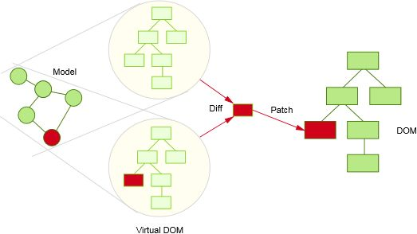
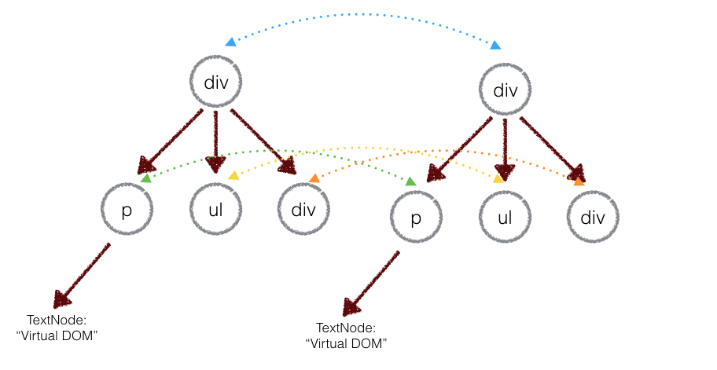

1\. 虚拟DOM [#](#t01. 虚拟DOM)
--------------------------

*   所谓的`virtual dom`，也就是虚拟节点。它通过`JS`的`Object`对象模拟DOM中的节点，然后再通过特定的`render`方法将其渲染成真实的DOM节点
    *   `dom diff` 则是通过`JS`层面的计算，返回一个`patch`对象，即补丁对象，在通过特定的操作解析`patch`对象，完成页面的重新渲染



2\. 实现步骤 [#](#t12. 实现步骤)
------------------------

1.  用JavaScript对象模拟DOM
2.  把此虚拟DOM转成真实DOM并插入页面中
3.  如果有事件发生修改了虚拟DOM
4.  比较两棵虚拟DOM树的差异，得到差异对象
5.  把差异对象应用到真正的DOM树上

3.代码实现 [#](#t23.代码实现)
---------------------

### 3.1 虚拟DOM [#](#t33.1 虚拟DOM)

用`JavaScript`对象结构表示`DOM`树的结构；然后用这个树构建一个真正的`DOM`树，插到文档当中

```js
let createElement=require('./element');
let ul1=createElement('ul',{class: 'list'},[
    createElement('li',{class: 'list1'},['1']),
    createElement('li',{class: 'list2'},['2']),
    createElement('li',{class:'list3'},['3'])
]);
let ul1Element = ul1.render();
document.body.appendChild(ul1Element);
```


```jsx
class Element{
    constructor(tagName,attrs,children) {
        this.tagName=tagName;
        this.attrs=attrs;
        this.children=children;
    }
    render() {
        let element=document.createElement(this.tagName);
        for (let attr in this.attrs) {
            element.setAttribute(attr,this.attrs[attr]);
        }
        let children=this.children||[];
        children.forEach(child => {
            let childElement=(child instanceof Element)? child.render():document.createTextNode(child);
            element.appendChild(childElement);
        });
        return element;
    }
}
```


​    
```jsx
module.exports=function (tagName,attrs,children) {
    return new Element(tagName,attrs,children);
}
```


### 3.2 DOM DIFF [#](#t43.2 DOM DIFF)

比较两棵DOM树的差异是`Virtual DOM`算法最核心的部分,`Read Diff`算法有三个优化策略

*   DOM节点的跨层级移动操作特别少，可以忽略不计

 

*   拥有相同类的两个组件会生成相似的树形结构，拥有不同类的两个组件将会生成不同的树形结构

*   对于同一层级的一组节点，它们可以通过唯一的key进行区分,开发人员可以使用一个`key`指示在不同的渲染中那个那些元素可以保持稳定。


#### 3.2.1 Diffing 算法 [#](#t53.2.1 Diffing 算法)

*   元素类型不相同,无论什么时候，当根元素类型不同时，React 将会销毁原先的树并重写构建新的树 ```js

    

    #### 3.2.2 DOM元素类型相同
    当比较两个相同类型的 React DOM 元素时，React 检查它们的属性（attributes），保留相同的底层 DOM 节点，只更新发生改变的属性（attributes）
    ```jsx
    <div className="before" title="stuff" />
    <div className="after" title="stuff" />
    
    ```

通过比较两个元素，React 会仅修改底层 DOM 节点的 className 属性。 当更新 style属性，React 也会仅仅只更新已经改变的属性，例如:

```jsx
<div style={{'{{'}}color: 'red', fontWeight: 'bold'}} />
<div style={{'{{'}}color: 'green', fontWeight: 'bold'}} />
```


当React对两个元素进行转化的时候，仅会修改`color`，而不会修改`fontWeight` 在处理完当前 DOM 节点后，React 会递归处理子节点。

### 3.3 计算差异 [#](#t63.3 计算差异)


```jsx
let utils=require('./utils');
const REPLACE='REPLACE';//节点整个被替换
const ATTRS='ATTRS';//属性改变
const REMOVE='REMOVE';//节点被移除
const TEXT='TEXT';//文本内容改变
let keyIndex=0;
function diff(oldTree,newTree) {
    keyIndex=0;
    let patches={};
    let index=0;
    walk(oldTree,newTree,index,patches);
    return patches;
}
/**
 * 
 * @param {*} oldNode 老节点
 * @param {*} newNode 新节点
 * @param {*} index 老节点在旧树深度遍历中的索引
 * @param {*} patches 补丁对象
 */
function walk(oldNode,newNode,index,patches) {
    let currentPatch=[];
    if (newNode == null) {
        currentPatch.push({type:REMOVE,index});
    } else if (utils.isString(oldNode)&&utils.isString(newNode)) {
        if (oldNode != newNode) {
            currentPatch.push({type:TEXT,content:newNode});
        }
    } else if (oldNode.tagName==newNode.tagName) {
        let attrsPatch=diffAttrs(oldNode,newNode);
        if (Object.keys(attrsPatch).length>0) {
            currentPatch.push(attrsPatch);
        }
        diffChildren(oldNode.children,newNode.children,index,patches);
    } else {
        currentPatch.push({type:REMOVE,node:newNode});
    }
    if(currentPatch.length>0)
       patches[index]=currentPatch;
}
function diffChildren(oldChildren,newChildren,index,patches) {
    oldChildren.forEach((oldChild,idx) => {
        walk(oldChild,newChildren[idx],++keyIndex,patches);
    });
}

function diffAttrs(oldNode,newNode) {
    let attrsPatch={};
    for (let attr in oldNode.attrs) {
        if (oldNode.attrs[attr]!=newNode.attrs[attr]) {
            attrsPatch[attr]=newNode.attrs[attr];
        }
    }
    for (let attr in newNode.attrs) {
        if (!(oldNode.attrs.hasOwnProperty(attr))) {
            attrsPatch[attr]=newNode.attrs[attr];
        }
    }
    return attrsPatch;
}
module.exports=diff;
```


### 3.4 打补丁 [#](#t73.4 打补丁)

```jsx
let {REPLACE,ATTRS,REMOVE,TEXT}=require('./diff');
let keyIndex=0;
let allPatches;
let utils=require('./utils');
function patch(root,patches) {
    keyIndex=0;
    allPatches=patches;
    walk(root);
}

function walk(node) {
    let currentPatches=allPatches[keyIndex++];
    (node.childNodes||[]).forEach(child => {
        walk(child);
    });
    if (currentPatches) {
        dealPatches(node,currentPatches);
    }
}
function dealPatches(node,currentPatches) {
    currentPatches.forEach(currentPatch => {
        switch (currentPatch.type) {
            case REPLACE:
                let newNode=(typeof currentPatch.node=='string')? document.createTextNode(currentPatch.node):currentPath.node.render();
                node.parentNode.replaceChild(newNode,node);
                break;
            case ATTRS:
                for (let attr in currentPatch.attrs) {
                    if (currentPatch.attrs[attr]) {
                        utils.setAttr(node,attr,currentPatch.attrs[attr]);
                    } else {
                        node.removeAttribute(attr);
                    }
                }
                break;
            case TEXT:
                node.textContent=currentPatch.content;
            default:
                break;    
        }
    });
}

module.exports=patch;
```


### 3.5 keys作用 [#](#t83.5 keys作用)

*   删除一个
*   第一个换到最后一个
*   最后一个换到第一个
*   少创建DOM

```jsx
const newKeys = ['C', 'B', 'D', 'E']; 
const patches = diff(oldKeys, newKeys); 
patch(root, patches);
function patch(root, patches = []) {
  patches.forEach(patch => { 
    let oldNode; switch (patch.type) { 
      case 'INSERT': oldNode = root.childNodes[patch.index];
        let newNode = document.createElement('li'); 
        newNode.innerHTML = patch.key;
        if (oldNode) { 
          root.insertBefore(newNode, oldNode);
         } else { 
           root.appendChild(newNode);
         }
        break;
      case 'REMOVE': oldNode = root.childNodes[patch.index];
        if (oldNode) root.removeChild(oldNode);
        break;
    } });
}

function diff(oldKeys, newKeys) { //清除没用的key
  let oldIndex = 0;
  let patches = [];
  while (oldIndex < oldKeys.length) { 
    let oldKey = oldKeys[oldIndex]; 
    if (!newKeys.includes(oldKey)) { 
      remove(oldIndex);
      oldKeys.splice(oldIndex, 1);
    } else { 
      oldIndex++;
    } }

```

```jsx
//构造新的列表
oldIndex = 0;
let newIndex = 0;
while (newIndex < newKeys.length) {
    let oldKey = oldKeys[oldIndex];
    let newKey = newKeys[newIndex];
    if (!oldKey || oldKey !== newKey) {
        insert(newIndex, newKey);
        newIndex++;
    } else {
        newIndex++;
        oldIndex++;
    }
}

while (oldIndex++ < oldKeys.length) {
    remove(newIndex);
}

function remove(index) {
    patches.push({ type: 'REMOVE', index });
}
function insert(index, key) {
    patches.push({ type: 'INSERT', index, key });
}
return patches;
}
```


```jsx

//const oldKeys = ['A', 'B', 'C', 'D'];
class Element {
    constructor(tagName, key, children) {
        this.tagName = tagName;
        this.key = key;
        this.children = children;
    }
    render() {
        let element = document.createElement(this.tagName);
        element.innerHTML = this.children;
        element.setAttribute('key', this.key);
        return element;
    }
}
function el(tagName, key, children) {
    return new Element(tagName, key, children);
}
// abcd bcda
//最后移动到第一个
//第一个移到到最后
const oldChildren = [
    el('li', 'A', 'A'),
    el('li', 'B', 'B'),
    el('li', 'C', 'C'),
    el('li', 'D', 'D'),
];
const root = document.createElement('ul');
oldChildren.forEach(item => {
    root.appendChild(item.render());
});
document.body.appendChild(root);

const newChildren = [
    el('li', 'B', 'B'),
    el('li', 'C', 'C'),
    el('li', 'D', 'D'),
    el('li', 'A', 'A'),
];

function render() {
    let newNode = document.createElement(this.tagName);
    newNode.innerHTML = this.children;
    newNode.setAttribute('key', this.key);
    return newNode;
}

const patches = diff(oldChildren, newChildren);
console.log(patches);
patch(root, patches);
function patch(root, patches = []) {
    patches.forEach(patch => {
        let oldNode;
        switch (patch.type) {
            case 'INSERT':
                console.log('INSERT');
                oldNode = root.childNodes[patch.index];
                let newNode = patch.node.render();
                if (oldNode) {
                    root.insertBefore(newNode, oldNode);
                } else {
                    root.appendChild(newNode);
                }
                break;
            case 'REMOVE':
                console.log('REMOVE');
                oldNode = root.childNodes[patch.index];
                if (oldNode)
                    root.removeChild(oldNode);
                break;
        }
    });
}

function diff(oldChildren, newChildren) {
    let newKeys = newChildren.map(item => item.key);
    //清除没用的key
    let oldIndex = 0;
    let patches = [];
    while (oldIndex < oldChildren.length) {
        let oldKey = oldChildren[oldIndex].key;
        if (!newKeys.includes(oldKey)) {
            remove(oldIndex);
            oldChildren.splice(oldIndex, 1);
        } else {
            oldIndex++;
        }
    }

    //构造新的列表
    oldIndex = 0;
    let newIndex = 0;
    while (newIndex < newChildren.length) {
        let oldKey = (oldChildren[oldIndex] || {}).key;
        let newKey = (newChildren[newIndex] || {}).key;
        if (!oldKey) {
            insert(newIndex, newKey);
            newIndex++;
        } else if (oldKey !== newKey) {
            let nextOldKey = (oldChildren[oldIndex + 1] || {}).key;
            if (nextOldKey === newKey) {
                remove(newIndex);
                oldChildren.splice(oldIndex, 1);
            } else {
                insert(newIndex, newKey);
                newIndex++;
            }
        } else {
            newIndex++;
            oldIndex++;
        }
    }

    while (oldIndex++ < oldChildren.length) {
        remove(newIndex);
    }

    function remove(index) {
        patches.push({ type: 'REMOVE', index });
    }
    function insert(index, key) {
        patches.push({ type: 'INSERT', index, node: { tagName: 'li', key: key, children: key, render } });
    }
    return patches;
}
```


```jsx
//const oldKeys = ['A', 'B', 'C', 'D'];
class Element {
    constructor(tagName, key, children) {
        this.tagName = tagName;
        this.key = key;
        this.children = children;
    }
    render() {
        console.log('render');
        let element = document.createElement(this.tagName);
        element.innerHTML = this.children;
        element.setAttribute('key', this.key);
        return element;
    }
}
function el(tagName, key, children) {
    return new Element(tagName, key, children);
}
// abcd bcda
//最后移动到第一个
//第一个移到到最后
const oldChildren = [
    el('li', 'A', 'A'),
    el('li', 'B', 'B'),
    el('li', 'C', 'C'),
    el('li', 'D', 'D'),
    el('li', 'E', 'E')

];
const root = document.createElement('ul');
oldChildren.forEach(item => {
    root.appendChild(item.render());
});
document.body.appendChild(root);

const newChildren = [
    el('li', 'B', 'B'),
    el('li', 'C', 'C'),
    el('li', 'D', 'D'),
    el('li', 'A', 'A'),
    el('li', 'F', 'F')
];

function render() {
    let newNode = document.createElement(this.tagName);
    newNode.innerHTML = this.children;
    newNode.setAttribute('key', this.key);
    return newNode;
}

const patches = diff(oldChildren, newChildren);
console.log(patches);
patch(root, patches);
function patch(root, patches = []) {
    let map = Array.from(root.childNodes).map(node => (
        { [node.key]: node }
    ));
    patches.forEach(patch => {
        let oldNode;
        switch (patch.type) {
            case 'INSERT':
                oldNode = root.childNodes[patch.index];
                let newNode = map[patch.key] ? map[patch.key] : patch.node.render();
                if (oldNode) {
                    root.insertBefore(newNode, oldNode);
                } else {
                    root.appendChild(newNode);
                }

                break;
            case 'REMOVE':
                console.log('REMOVE');
                oldNode = root.childNodes[patch.index];
                if (oldNode)
                    root.removeChild(oldNode);
                break;
        }
    });
}

function diff(oldChildren, newChildren) {
    let newKeys = newChildren.map(item => item.key);
    //清除没用的key
    let oldIndex = 0;
    let patches = [];
    while (oldIndex < oldChildren.length) {
        let oldKey = oldChildren[oldIndex].key;
        if (!newKeys.includes(oldKey)) {
            remove(oldIndex);
            oldChildren.splice(oldIndex, 1);
        } else {
            oldIndex++;
        }
    }

    //构造新的列表
    oldIndex = 0;
    let newIndex = 0;
    while (newIndex < newChildren.length) {
        let oldKey = (oldChildren[oldIndex] || {}).key;
        let newKey = (newChildren[newIndex] || {}).key;
        if (!oldKey) {
            insert(newIndex, newKey);
            newIndex++;
        } else if (oldKey !== newKey) {
            let nextOldKey = (oldChildren[oldIndex + 1] || {}).key;
            if (nextOldKey === newKey) {
                remove(newIndex);
                oldChildren.splice(oldIndex, 1);
            } else {
                insert(newIndex, newKey);
                newIndex++;
            }
        } else {
            newIndex++;
            oldIndex++;
        }
    }

    while (oldIndex++ < oldChildren.length) {
        remove(newIndex);
    }

    function remove(index) {
        patches.push({ type: 'REMOVE', index });
    }
    function insert(index, key) {
        patches.push({ type: 'INSERT', index, node: { tagName: 'li', key: key, children: key, render } });
    }
    return patches;
}
```


### 3.5 常见场景优化 [#](#t93.5 常见场景优化)

#### 3.5.1 头部添加一个元素 [#](#t103.5.1 头部添加一个元素)

```js
const oldKeys=['A','B','C','D'];
const newKeys=['D','A','B','C','E'];
```


```js
[{type: "INSERT", index: 0, key: "E"}]
```


#### 3.5.2 中间添加一个元素 [#](#t113.5.2 中间添加一个元素)

```js
const oldKeys=['A','B','C','D'];
const newKeys=['A','B','E','C','D'];
```


```js
[{type: "INSERT", index: 2, key: "E"}]
```


#### 3.5.3 尾部添加一个元素 [#](#t123.5.3 尾部添加一个元素)

```js
const oldKeys=['A','B','C','D'];
const newKeys=['A','B','C','D','E'];
```


```js
[{type: "INSERT", index: 4, key: "E"}]
```


#### 3.5.4 头部删除一个元素 [#](#t133.5.4 头部删除一个元素)

```js
const oldKeys=['A','B','C','D'];
const newKeys=['B','C','D'];
```


```js
{type: "REMOVE", index: 0}
```


#### 3.5.5 中间删除一个元素 [#](#t143.5.5 中间删除一个元素)

```js
const oldKeys=['A','B','C','D'];
const newKeys=['A','C','D'];
```

```js
{type: "REMOVE", index: 1}
```


#### 3.5.6 尾部删除一个元素 [#](#t153.5.6 尾部删除一个元素)

```js
const oldKeys=['A','B','C','D'];
const newKeys=['A','B','C'];
```


```js
{type: "REMOVE", index: 3}
```


#### 3.5.7 性能杀手 [#](#t163.5.7 性能杀手)

