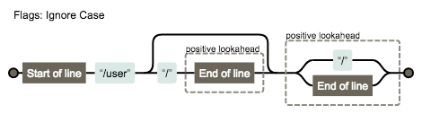
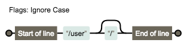
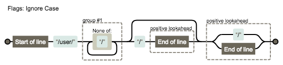

[[toc]]

# React路由
------------------------------

*   不同的路径渲染不同的组件
*   有两种实现方式
    *   HashRouter:利用hash实现路由切换
    *   BrowserRouter:实现h5 Api实现路由的切换

### 1.1 hash [#](#t11.1 hash)

```jsx
    <a href="#/a">去a</a>
    <a href="#/b">去b</a>
    <script>
      window.addEventListener('hashchange',()=>{
          console.log(window.location.hash);
      });
    </script>
```


### 1.2 history [#](#t21.2 history)

*   history对象提供了操作浏览器会话历史的接口。
*   history对象持续追踪着一组location
*   除了一组location外，history也保存一个索引值，用来指向当前所对应的location
*   [history](https://developer.mozilla.org/zh-CN/docs/Web/API/Window/history)
*   [History](https://developer.mozilla.org/en-US/docs/Web/API/History)
*   [onpopstate](https://developer.mozilla.org/zh-CN/docs/Web/API/Window/onpopstate)

2.跑通路由 [#](#t32.跑通路由)
---------------------

### 2.1 index.js [#](#t42.1 index.js)

```jsx
import React from 'react';
import ReactDOM from 'react-dom';
import {HashRouter as Router,Route} from 'react-router-dom';
import Home from './components/Home';
import User from './components/User';
import Profile from './components/Profile';
ReactDOM.render(
    <Router>
        <div>
          <Route path="/" component={Home} />
          <Route path="/user" component={User} />
          <Route path="/profile" component={Profile}/>
        </div>
    </Router>
,document.getElementById('root'));
```


### 2.2 Home.js [#](#t52.2 Home.js)

components/Home.js

```jsx
import React,{Component} from 'react';
export default class Home extends Component{
    render() {
        return (
            <div>Home</div>
        )
    }
}
```


### 2.3 Profile.js [#](#t62.3 Profile.js)

components/Profile.js

```jsx
import React,{Component} from 'react';
export default class Profile extends Component{
    render() {
        return (
            <div>Profile</div>
        )
    }
}
```


### 2.4 User.js [#](#t72.4 User.js)

components/User.js

```jsx
import React,{Component} from 'react';
export default class User extends Component{
    render() {
        return (
            <div>User</div>
        )
    }
}
```


### 2.5 this.props [#](#t82.5 this.props)

> [http://localhost:3000/#/user?name=zxmf#top](http://localhost:3000/#/user?name=zxmf#top)

```jsx
{
    "match": {
        "path": "/user/:id",   //匹配路径
        "url": "/user/1",      //地址栏中的url
        "isExact": true,       //是否精确匹配
        "params": {"id": "1"}  // 路径参数对象
    },
    "location": {
        "pathname": "/user/1",  //路径名
        "search": "?name=zxmf", //查询字符串
        "hash": "#top"          //hash值
        "state":undefined
    },
    "history": {
        "length": 6,            //历史长度
        "action": "POP",        //动作
        "location": {           //当前应用所处的位置
            "pathname": "/user/1",
            "search": "?name=zxmf",
            "hash": "#top",
            "state":undefined  //location可以拥有与之相关的状态。这是一些固定的数据，并且不存在于URL之中
        },
        "go":f go(n),//是一个强大的方法，并包含了goForward与goBack的功能。传入负数则退后，传入正数则向前
        "goBack":f goBack(),//返回一层页面。实际上是将history的索引值减1
        "goForward":f goForward(),//与goBack相对。向前一层页面
        "listen":f listen(listener),//采用观察者模式，在location改变时，history会发出通知
        "push":f push(path,state),//方法使能你跳转到新的location
        "replace":f replace(path,state)//replace方法与push相似，但它并非添加location，而是替换当前索引上的位置,重定向时要使用replace,
        "createHref":f createHref(location)
    }
}
```


### 2.6 createHref [#](#t92.6  createHref)

```jsx
const location = {
  pathname: '/user',
  search: '?id=1',
  hash: '#bottom'
}
const url = history.createHref(location)
const link = document.createElement('a')
a.href = url
// <a href='/user?id=1#bottom'></a>
```


3.实现基本路由 [#](#t103.实现基本路由)
--------------------------

*   [react-router](https://reacttraining.com/react-router/web/example/basic)

### 3.1 index.js [#](#t113.1 index.js)

src/index.js

```jsx
import React from 'react';
import ReactDOM from 'react-dom';
import {HashRouter as Router,Route} from './react-router-dom';
import Home from './components/Home';
import User from './components/User';
import Profile from './components/Profile';
ReactDOM.render(
    <Router>
        <div>
          <Route path="/" component={Home} />
            <Route path="/user" component={User} />
          <Route path="/profile" component={Profile}/>
        </div>
    </Router>
,document.getElementById('root'));
```


### 3.2 index.js [#](#t123.2 index.js)

src/react-router-dom/index.js

```jsx
import HashRouter from './HashRouter';
import Route from './Route';

export {
    HashRouter,
    Route
}
```


### 3.3 context.js [#](#t133.3 context.js)

src/react-router-dom/context.js

```jsx
import React from 'react';
// React16.3
let {Provider,Consumer}=React.createContext();
export {Provider,Consumer};
```


### 3.4 HashRouter.js [#](#t143.4 HashRouter.js)

src/react-router-dom/HashRouter.js

```jsx
import React,{Component} from 'react';
import {Provider} from './context';
export default class HashRouter extends Component{
    state={
        location: {
            pathname:window.location.hash?window.location.hash.slice(1):'/'
        }
    }
    componentDidMount() {
        //默认hash没有的时候跳转到/
        window.location.hash=window.location.hash||'/';
        //监听hash值变化
        window.addEventListener('hashchange',() => {
            this.setState({
                location: {
                ...this.state.location,
                pathname:window.location.hash?window.location.hash.slice(1):'/'
            }});
        });
    }
    render() {
        let value={
            location:this.state.location
        }
        return (
            <Provider value={value}>
                {this.props.children}
            </Provider>
        )
    }
}
```


### 3.5 Route.js [#](#t153.5 Route.js)

src/react-router-dom/Route.js

```jsx
import React,{Component} from 'react';
import {Consumer} from './context';
export default class Route extends Component{
    render() {
        let {path,component: Component}=this.props;
        return (
            <Consumer>
                {
                    value => {
                        let {pathname}=value.location;
                        if (path == pathname) {
                            return <Component/>
                        } else {
                            return null;
                        }
                    }
                }
            </Consumer>
        )
    }
}
```


4\. path-to-regexp [#](#t164. path-to-regexp)
---------------------------------------------

把一个路径转换成正则表达式

*   [path-to-regexp](https://www.npmjs.com/package/path-to-regexp)

*   [regexper](https://regexper.com/)

    

    

    

    ```jsx
    let pathToRegexp=require('path-to-regexp');
    //let regex=pathToRegexp('/user',[],{end: true});// /^\/user(?:\/)?$/i
    //let regex=pathToRegexp('/user',[],{end: false});// //^\/user(?:\/(?=$))?(?=\/|$)/i
    let keys=[];
    let regex=pathToRegexp('/user/:id',keys,{end: false});///^\/user\/([^\/]+?)(?:\/(?=$))?(?=\/|$)/i
    // (?:) 是 不想被捕获的时候使用
    // (?=pattern) 零宽正向先行断言(zero-width positive lookahead assertion)
    console.log(regex);
    console.log(keys);
    //console.log(regex.test('/user'));   //true
    //console.log(regex.test('/user/1')); //true
    console.log(regex.test('/user/1')); //true
    ```


5\. 正则匹配路径 [#](#t175. 正则匹配路径)
-----------------------------

### 5.1 Route.js [#](#t185.1 Route.js)

src/react-router-dom/Route.js

```jsx
import React,{Component} from 'react';
import {Consumer} from './context';
import pathToRegexp from 'path-to-regexp';
export default class Route extends Component{
    render() {
        let {path,component: Component}=this.props;
        let regexp=pathToRegexp(path,[],{end:false});
        return (
            <Consumer>
                {
                    value => {
                        let {pathname}=value.location;
                        if (regexp.test(pathname)) {
                            return <Component/>
                        } else {
                            return null;
                        }
                    }
                }
            </Consumer>
        )
    }
}
```


6.exact 精确匹配 [#](#t196.exact 精确匹配)
----------------------------------

### 6.1 index.js [#](#t206.1 index.js)

src/index.js

```jsx
ReactDOM.render(
    <Router>
        <div>
           <Route exact={true} path="/" component={Home} />
            <Route path="/user" component={User} />
          <Route path="/profile" component={Profile}/>
        </div>
    </Router>
,document.getElementById('root'));
```


### 6.2 Route.js [#](#t216.2  Route.js)

src/react-router-dom/Route.js

```jsx
export default class Route extends Component{
    render() {
       let {path,component: Component,exact=false}=this.props;
       let regexp=pathToRegexp(path,[],{end:exact});
        return (
            <Consumer>
                {
                    value => {
                        let {pathname}=value.location;
                        if (regexp.test(pathname)) {
                            return <Component/>
                        } else {
                            return null;
                        }
                    }
                }
            </Consumer>
        )
    }
}
```


7\. Link [#](#t227. Link)
-------------------------

### 7.1 Link.js [#](#t237.1 Link.js)

src/react-router-dom/Link.js

```jsx
import React,{Component} from 'react';
import {Consumer} from './context';
export default class Link extends Component{
    render() {
        return (
            <Consumer>
                {
                    value => {
                        let {history: {push}}=value;
                        return (
                            <a onClick={()=>push(this.props.to)}>{this.props.children}</a>
                        )
                    }
                }
            </Consumer>
        )
    }
}
```


### 7.2 index.js [#](#t247.2 index.js)

src/index.js

```jsx
import 'bootstrap/dist/css/bootstrap.css'
ReactDOM.render(
    <Router>
        <div>
            <nav className="navbar navbar-inverse">
                <div className="container-fluid">
                    <div className="navbar-header">
                        <a className="navbar-brand" >学生管理系统</a>
                    </div>
                    <div id="navbar" className="collapse navbar-collapse">
                        <ul className="nav navbar-nav">
                            <li><Link to="/">Home</Link></li>
                            <li><Link to="/user">User</Link></li>
                            <li><Link to="/profile">Profile</Link></li>
                        </ul>
                    </div>
                </div>
            </nav>
            <div className="container">
                <Route exact={true} path="/" component={Home} />
                <Route path="/user" component={User} />
                <Route path="/profile" component={Profile}/>
            </div>
        </div>
    </Router>
,document.getElementById('root'));
```


### 7.3 HashRouter.js [#](#t257.3 HashRouter.js)

src/react-router-dom/HashRouter.js

```jsx
    render() {
        let value={
            location: this.state.location,
            history: {
                push(to) {
                    window.location.hash=to;
                }
            }
        }
        return (
            <Provider value={value}>
                {this.props.children}
            </Provider>
        )
    }
```


8.Redirect&Switch [#](#t268.Redirect&Switch)
--------------------------------------------

### 8.1 index.js [#](#t278.1 index.js)

src/index.js

```jsx
<div className="container">
                <Switch>
                    <Route exact={true} path="/" component={Home} />
                    <Route path="/user" component={User} />
                    <Route path="/profile" component={Profile} />
                    <Redirect to="/"/>
                </Switch>
            </div>
```


### 8.2 Redirect.js [#](#t288.2 Redirect.js)

src/react-router-dom/Redirect.js

```jsx
import React,{Component} from 'react';
import {Consumer} from './context';
export default class Redirect extends Component{
    render() {
        return (
            <Consumer>
                {
                    value => {
                        value.history.push(this.props.to);
                        return null;
                    }
                }
            </Consumer>
        )
    }
}
```


### 8.3 Switch.js [#](#t298.3  Switch.js)

src/react-router-dom/Switch.js

```jsx
import React,{Component} from 'react';
import {Consumer} from './context';
import pathToRegexp from 'path-to-regexp';
export default class Switch extends Component{
    render() {
        return (
            <Consumer>
                {
                    value => {
                        let {location: {pathname}}=value;
                        let children=this.props.children;
                        for (let i=0;i<children.length;i++){
                            let child=children[i];
                            let {path="/",exact=false}=child.props;
                            let regexp=pathToRegexp(path,[],{end: exact});
                            if (regexp.test(pathname)) {
                                return child;
                            }
                        }
                        return null;
                    }
                }
            </Consumer>
        )
    }
}
```


9.页面跳转 [#](#t309.页面跳转)
----------------------

### 9.1 User.js [#](#t319.1  User.js)

src/components/User.js

```jsx
 <Switch>
    <Route path="/user/add" component={UserAdd} />
    <Route path="/user/list" component={UserList} />
    <Route path="/user/detail/:id" component={UserDetail}/>
</Switch>
```


### 9.2 HashRouter.js [#](#t329.2 HashRouter.js)

src/react-router-dom/HashRouter.js

```jsx
    render() {
        let value={
            location: this.state.location,
            history: {
                push(to) {
                    window.location.hash=to;
                }
            }
        }
        return (
            <Provider value={value}>
                {this.props.children}
            </Provider>
        )
    }
```


### 9.3 Route.js [#](#t339.3  Route.js)

src/react-router-dom/Route.js

```jsx
import React,{Component} from 'react';
import {Consumer} from './context';
import pathToRegexp from 'path-to-regexp';
export default class Route extends Component{
    constructor(props) {
        super(props);
    }
    render() {
        let {path,component: Component,exact=false}=this.props;
        return (
            <Consumer>
                {
                    value => {
                        let {pathname}=value.location;
                        let keys=[];
                        let regexp=pathToRegexp(path,keys,{end: exact});
                        keys = keys.map(item=>item.name)
                        let result=pathname.match(regexp);
                        if (result) {
                            let [,...values]=result;
                            let match={
                                params: keys.reduce((params,key,idx) => {
                                    params[key]=values[idx];
                                    return params;
                                },{}),
                                path,
                                url: pathname
                            };

                            let props={
                                location: value.location,
                                history: value.history,
                                match
                            }
                            return <Component {...props}/>
                        } else {
                            return null;
                        }
                    }
                }
            </Consumer>
        )
    }
}
```


### 9.4 Switch.js [#](#t349.4  Switch.js)

src/react-router-dom/Switch.js

```jsx
import React,{Component} from 'react';
import {Consumer} from './context';
import pathToRegexp from 'path-to-regexp';
export default class Switch extends Component{
    render() {
        return (
            <Consumer>
                {
                    value => {
                        let {location: {pathname}}=value;
                        let children=this.props.children;
                        for (let i=0;i<children.length;i++){
                            let child=children[i];
                            let {path="/",exact=false}=child.props;
                            let regexp=pathToRegexp(path,[],{end: exact});
                            if (regexp.test(pathname)) {
                                return child;
                            }
                        }
                        return null;
                    }
                }
            </Consumer>
        )
    }
}
```


### 9.5 UserAdd.js [#](#t359.5  UserAdd.js)

src/components/UserAdd.js

```jsx
import React,{Component} from 'react';
export default class UserAdd extends Component{
    handleSubmit=(event) => {
        event.preventDefault();
        let username=this.username.value;
        let email=this.email.value;
        let user={username,email};
        let usersStr=localStorage.getItem('users');
        let users=usersStr? JSON.parse(usersStr):[];
        user.id = users.length>0? users[users.length-1].id+1:1;
        users.push(user);
        localStorage.setItem('users',JSON.stringify(users));
        this.props.history.push('/user/list');
    }
    render() {
        return (
            <div className="row">
                <div className="col-md-12">
                    <form onSubmit={this.handleSubmit}>
                        <div className="form-group">
                            <label htmlFor="username">用户名</label>
                            <input type="text" className="form-control" ref={input=>this.username = input}/>
                        </div>
                        <div className="form-group">
                            <label htmlFor="email">邮箱 </label>
                            <input type="email" className="form-control" ref={input=>this.email = input}/>
                        </div>
                        <div className="form-group">
                            <input type="submit" className="btn btn-primary"/>
                        </div>
                    </form>
                </div>
            </div>
        )
    }
}
```


### 9.6 UserDetail.js [#](#t369.6 UserDetail.js)

src/components/UserDetail.js

```jsx
import React,{Component} from 'react';
export default class UserList extends Component{
    state={
        user: {}
    }
    componentDidMount() {
        let usersStr=localStorage.getItem('users');
        let users=usersStr? JSON.parse(usersStr):[];
        let user = users.find(user => user.id==this.props.match.params.id);
        this.setState({user});
    }
    render() {
        let {user}=this.state;
        return (
            <div className="row">
                <div className="col-md-12">
                    <div>ID:{user.id}</div>
                    <div>用户名:{user.username}</div>
                    <div>邮箱:{user.email}</div>
                </div>
            </div>
        )
    }
}
```


### 9.7 UserList.js [#](#t379.7 UserList.js)

src/components/UserList.js

```jsx
import React,{Component} from 'react';
import {Link} from '../react-router-dom';
export default class UserList extends Component{
    state={
        users:[]
    }
    componentDidMount() {
        let usersStr=localStorage.getItem('users');
        let users=usersStr? JSON.parse(usersStr):[];
        this.setState({users});
    }
    render() {
        return (
            <div className="row">
                <div className="col-md-12">
                    <ul className="list-group">
                        {
                            this.state.users.map(user => (
                                <li className="list-group-item" key={user.id}>
                                    <Link to={`/user/detail/${user.id}`}>{user.username}</Link>
                                </li>
                            ))
                        }
                    </ul>
                </div>
            </div>
        )
    }
}
```


10\. 受保护的路由 [#](#t3810. 受保护的路由)
-------------------------------

### 10.1 src/index.js [#](#t3910.1 src/index.js)

```jsx
                <Switch>
                    <Route exact={true} path="/" component={Home} />
                    <Route path="/user" component={User} />
                    <Route path="/login" component={Login} />
                    <Protected path="/profile" component={Profile} />
                    <Redirect to="/"/>
                </Switch>
```


### 10.2 HashRouter.js [#](#t4010.2 HashRouter.js)

src/react-router-dom/HashRouter.js

```jsx
render() {
        let self=this;
        let value={
            location: self.state.location,
            history: {
                push(to) {
                    if (typeof to == 'object') {
                        let {pathname,state}=to;
                        self.setState({
                            location: {
                                ...self.state.location,state,pathname
                            }
                        },() => {
                            window.location.hash=pathname;
                        });
                    } else {
                        window.location.hash=to;
                    }
                }
            }
        }
        return (
            <Provider value={value}>
                {this.props.children}
            </Provider>
        )
    }
```


### 10.3 Route.js [#](#t4110.3 Route.js)

src/react-router-dom/Route.js

```jsx
                             if (Component) {
                                return <Component {...props}/>
                            } else if (render) {
                                return render(props);
                            } else {
                                return null;
                            }
```


### 10.4 Login.js [#](#t4210.4 Login.js)

src/components/Login.js

```jsx
import React from 'react'
export default class Login extends React.Component{
   handleClick=() => {
       localStorage.setItem('logined',true);
   	this.props.history.push(this.props.location.state.from);
   }
   render() {
       return (
           <div>
                <button
                    className="btn btn-primary"
                    onClick={this.handleClick}
                >登录</button>
            </div>
       )
   }
}
```


### 10.5 Protected.js [#](#t4310.5 Protected.js)

src/components/Protected.js

```jsx
 import React from 'react'
 import {Route,Redirect} from '../react-router-dom';
 export default ({component:Component,...rest}) => (
     <Route
         {...rest}
         render={
             props => (
                 localStorage.getItem('logined')?
                     <Component {...props} />:
                     <Redirect to={{pathname: '/login',state: {from: props.location.pathname}}} />
             )
         }
     />
 )
```


11\. 自定义导航 [#](#t4411. 自定义导航)
-----------------------------

### 11.1 index.js [#](#t4511.1 index.js)

src/index.js

```jsx
<ul className="nav navbar-nav">
    <MenuLink exact to="/">Home</MenuLink>
    <MenuLink to="/user">User</MenuLink>
    <MenuLink to="/profile">Profile</MenuLink>
</ul>
```


### 11.2 Route.js [#](#t4611.2  Route.js)

src/react-router-dom/Route.js

```jsx
 let props={
                            location: value.location,
                            history: value.history
                        }
                        if (result) {
                            let [,...values]=result;
                            let match={
                                params: keys.reduce((params,key,idx) => {
                                    params[key]=values[idx];
                                    return params;
                                },{}),
                                path,
                                url: pathname
                            };

                            props.match = match;
                            if (Component) {
                                return <Component {...props}/>
                            } else if (render) {
                                return render(props);
                            } else if(children){
                                return children(props);
                            }else {
                              return null;
                            }
                        } else if(children){
                            return children(props);
                        } else {
                            return null;
                        }
```


### 11.3 MenuLink.js [#](#t4711.3 MenuLink.js)

```jsx
import React from 'react'
import {Route,Link} from '../react-router-dom';
import './MenuLink.css'
export default ({to,exact,children}) => (
    <Route
        path={to}
        exact={exact}
        children={
            props => (
                <li className={props.match?'active':''}><Link to={to}>{children}</Link></li>
            )
        }
    />
)
```


### 11.4 MenuLink.css [#](#t4811.4  MenuLink.css)

```css
.navbar-inverse .navbar-nav > .active > a{
    background-color: orange;
}
```


12\. 防止跳转 [#](#t4912. 防止跳转)
---------------------------

### 12.1 UserAdd.js [#](#t5012.1 UserAdd.js)

src/components/UserAdd.js

```jsx
import React,{Component} from 'react';
import {Prompt} from '../react-router-dom';
export default class UserAdd extends Component{
    state={
        isBlocking:false
    }
    handleSubmit=(event) => {
        event.preventDefault();
        this.setState({
            isBlocking:false
        },() => {
            let username=this.username.value;
            let email=this.email.value;
            let user={username,email};
            let usersStr=localStorage.getItem('users');
            let users=usersStr? JSON.parse(usersStr):[];
            user.id = users.length>0? users[users.length-1].id+1:1;
            users.push(user);
            localStorage.setItem('users',JSON.stringify(users));
            this.props.history.push('/user/list');
        });
    }
    render() {
        let {isBlocking}=this.state;
        return (
            <div className="row">
                <div className="col-md-12">
                    <form onSubmit={this.handleSubmit}>
                        <Prompt
                            when={isBlocking}
                            message={
                                location=>`你确定要跳转到${location.pathname}吗？`
                            }
                        />
                        <div className="form-group">
                            <label htmlFor="username">用户名</label>
                            <input type="text"
                                onChange={
                                    event => this.setState({isBlocking:event.target.value.length>0})
                                }
                                className="form-control" ref={input => this.username=input} />
                        </div>
                        <div className="form-group">
                            <label htmlFor="email">邮箱 </label>
                            <input
                                onChange={
                                    event => this.setState({isBlocking:event.target.value.length>0})
                                }
                                type="email" className="form-control" ref={input => this.email=input} />
                        </div>
                        <div className="form-group">
                            <input type="submit" className="btn btn-primary"/>
                        </div>
                    </form>
                </div>
            </div>
        )
    }
}
```


### 12.2 HashRouter.js [#](#t5112.2  HashRouter.js)

src/react-router-dom/HashRouter.js

```jsx
let value={
            location: self.state.location,
            history: {
                push(to) {
                    if (self.block) {
                        let allow=window.confirm(self.block(typeof to=='object'? to:{pathname:to}));
                        if (!allow) return;
                    }
                    if (typeof to == 'object') {
                        let {pathname,state}=to;
                        self.setState({
                            location: {
                                ...self.state.location,state,pathname
                            }
                        },() => {
                            window.location.hash=pathname;
                        });
                    } else {
                        window.location.hash=to;
                    }

                },
                block(message) {
                    self.block=message;
                },
                unblock() {
                    self.block=null;
                }
            }
        }
```


### 12.3 Prompt.js [#](#t5212.3 Prompt.js)

src/react-router-dom/Prompt.js

```jsx
import React from 'react'
import {Consumer} from './context'
export default class Prompt extends React.Component{
    componentWillUnmount() {
        this.history.unblock();
    }
    render() {
        return (
            <Consumer>
                {
                    value => {
                        this.history=value.history;
                        const {when,message}=this.props;
                        if (when) {
                            this.history.block(message);
                        } else {
                            this.history.block(null);
                        }
                    }
                }
            </Consumer>
        );
    }
}
```


13\. withRouter [#](#t5313. withRouter)
---------------------------------------

### 13.1 index.js [#](#t5413.1 index.js)

rc/index.js

```jsx
    <div className="container-fluid">
                    <Header/>
                    <div id="navbar" className="collapse navbar-collapse">
```


### 13.2 Route.js [#](#t5513.2 Route.js)

src/react-router-dom/Route.js

```jsx
    let {path='/',component: Component,exact=false,render,children}=this.props;
        return (
            <Consumer>
```


### 13.3 index.js [#](#t5613.3 index.js)

src/react-router-dom/index.js

```jsx
import withRouter from './withRouter';
export {
    HashRouter,
    Route,
    Link,
    Redirect,
    Switch,
    Prompt,
    withRouter
}
```


### 13.4 Header.js [#](#t5713.4 Header.js)

src/components/Header.js

```jsx
import React from 'react'
import {withRouter} from '../react-router-dom';
class Header extends React.Component{
    render() {
        return (
            <div className="navbar-header">
                <a
                    onClick={()=>this.props.history.push('/')}
                    className="navbar-brand" >
                   学生管理系统
                </a>
            </div>
        )
    }
}
export default withRouter(Header);
```


### 13.5 withRouter.js [#](#t5813.5 withRouter.js)

src/react-router-dom/withRouter.js

```jsx
import React from 'react'
import {Consumer} from './context';
import Route from './Route';
export default function (Component) {
    class Proxy extends React.Component{
        render() {
            return (
                <Consumer>
                    {
                        value => {
                            return <Route  component={Component}/>
                        }
                    }
               </Consumer>
            )
        }
    }
    return Proxy;
}
```


*   [router4](https://gitee.com/zhufengpeixun/router4)

