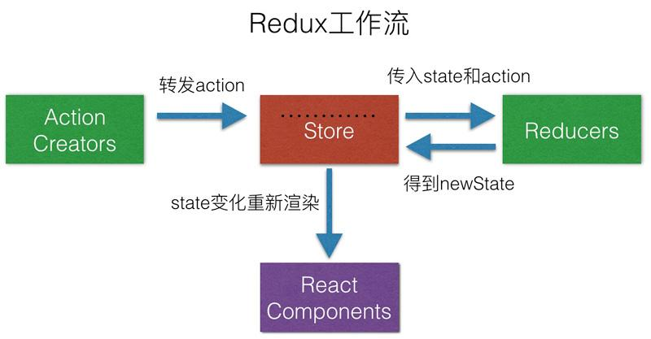

1\. Redux应用场景 [#](#t01. Redux应用场景)
----------------------------------

*   随着 JavaScript 单页应用开发日趋复杂,管理不断变化的 state 非常困难
*   Redux的出现就是为了解决state里的数据问题
*   在React中，数据在组件中是单向流动的
*   数据从一个方向父组件流向子组件(通过props)，由于这个特征，两个非父子关系的组件（或者称作兄弟组件）之间的通信就比较麻烦


2\. Redux设计思想 [#](#t12. Redux设计思想)
----------------------------------

*   Redux是将整个应用状态存储到到一个地方，称为store
*   里面保存一棵状态树(state tree)
*   组件可以派发(dispatch)行为(action)给store,而不是直接通知其它组件
*   其它组件可以通过订阅store中的状态(state)来刷新自己的视图.



3\. Redux三大原则 [#](#t23. Redux三大原则)
----------------------------------

*   整个应用的 state 被储存在一棵 object tree 中，并且这个 object tree 只存在于唯一一个 store 中
*   State 是只读的，惟一改变 state 的方法就是触发 action，action 是一个用于描述已发生事件的普通对象 使用纯函数来执行修改，为了描述action如何改变state tree ，你需要编写 reducers
*   单一数据源的设计让React的组件之间的通信更加方便，同时也便于状态的统一管理

4\. Redux概念解析 [#](#t34. Redux概念解析)
----------------------------------

### 4.1 Store [#](#t44.1 Store)

*   `Store`就是保存数据的地方，你可以把它看成一个容器。整个应用只能有一个`Store`
*   Redux 提供`createStore`这个函数，用来生成`Store`

    ```jsx
    import { createStore } from 'redux';
    const store = createStore(fn);
    ```

> 上面代码中，createStore函数接受另一个函数作为参数，返回新生成的Store对象。


### 4.2 State 

Store对象包含所有数据。如果想得到某个时点的数据，就要对Store生成快照。这种时间点的数据集合，就叫做State。 当前时刻的State，可以通过`store.getState()`拿到。

```jsx
import { createStore } from 'redux';
const store = createStore(fn);
const state = store.getState();
```


> Redux 规定， 一个 State 对应一个 View。只要 State 相同，View 就相同。你知道 State，就知道 View 是什么样，反之亦然。

### 4.3 Action

State的变化，会导致View的变化。但是，用户接触不到 State，只能接触到View 所以，State的变化必须是 View导致的。Action 就是 View 发出的通知，表示State 应该要发生变化了。 Action是一个对象。其中的type属性是必须的，表示 Action 的名称。其他属性可以自由设置，社区有一个规范可以参考。

```jsx
const action = {
  type: 'ADD_TODO',
  payload: '学习redux'
};
```


上面代码中，Action 的名称是`ADD_TODO`，它携带的信息是字符串`学习redux`。 可以这样理解，Action描述当前发生的事情。改变State的唯一办法，就是使用 Action。它会运送数据到 Store。

### 4.4 Action Creator 

View要发送多少种消息，就会有多少种 Action。如果都手写，会很麻烦。可以定义一个函数来生成 Action，这个函数就叫 Action Creator。

```jsx
const ADD_TODO = '添加 TODO';
function addTodo(text) {
  return {
    type: ADD_TODO,
    text
  }
}

const action = addTodo('学习Redux');
```


> 上面代码中，addTodo函数就是一个 Action Creator。

### 4.5 store.dispatch()

`store.dispatch()`是 View 发出 Action 的唯一方法。

```jsx
import { createStore } from 'redux';
const store = createStore(fn);

store.dispatch({
  type: 'ADD_TODO',
  payload: '学习Redux'
});
```


上面代码中，store.dispatch接受一个 Action 对象作为参数，将它发送出去。 结合 Action Creator，这段代码可以改写如下。

```jsx
store.dispatch(addTodo('学习Redux'))
```


### 4.6 Reducer [#](#t94.6 Reducer)

Store 收到 Action 以后，必须给出一个新的 State，这样 View 才会发生变化。 这种 State 的计算过程就叫做 Reducer。 Reducer 是一个纯函数，它接受 当前 State 和Action作为参数，返回一个新的 State。

```jsx
const reducer = function (state, action) {
  return new_state;
};
```


5.编写Redux [#](#t105.编写Redux)
----------------------------


```jsx
/**
 * 创建一个Redux仓库来保存整个状态树
 * 改变状态树的唯一方法是调用store.dispatch方法
 * 在整个应用中只能有一个仓库
 * 为了指定状态树的各个部分如何响应action的变化，你可能使用combineReducers方法把多个reducer合并为一个单独的reducer
 * 
 * @param {Function} reducer 一个通过当前状态对象和要处理的action返回新的状态树的函数
 * @param {any} [preloadedState] 初始状态。在同构应用中，你可能需要指定它以合并来自服务器的状态，或者从一个以前序列化的用户会话中恢复. 
 * 如果你使用了combineReducers,来从根reducer中产生状态，这必须是一个和combineReducer 的keys相同形状的对象
 * @param {Function} [enhancer] 仓库的enhancer. 你可能需要指定这个去增强仓库的能力以使用第三方的能力比如中间件
 * 时间旅行，持久化等等。redux自带的唯一中间件是applyMiddleware
 * @returns {Store} 是一个Redux仓库让你可以读取状态，派发action并订阅状态变化
 */

export default function createStore(reducer,preloadedState,enhancer) {
    if (enhancer) {
        return enhancer(createStore)(reducer,preloadedState);
    }
    let state=preloadedState;
    let listeners=[];
    /**
     * 读取仓库管理的状态树
     * @returns {any} 应用当前的状态树
     */
    function getState() {
        return state;
    }
    /**
     * 增加一个变化监听函数。它将在任何派发动作的时候被调用
     * 状态树的部分数据可能会发生潜在的变化。你可能在那个时候在回调函数中调用getState方法以获取最新的状态。
     * 你可能会在监听函数里调用dispatch方法，它会具备以下注意事项
     * 1. 订阅仅仅在每一次调用每一个dispatch方法时被记录快照
     * 如果你在监听函数被触发的时候订阅或取消订阅的话，这对当前正在处理中的dispatch没有任何效果
     * 尽管如此，在下一次dispatch方法的调用中，不管是不是内嵌，都将使用一个最新的订阅列表
     * 
     * 2.监听函数不应该预期所有的状态变化，因为状态可能在dispatch中被更新多次。 尽管如此，在 dispatch之前注册的订阅者将会以最新的状态调用
     * 
     * @param {*} listener  每一次dispatch时被调用的监听函数
     * @returns {Function} 返回一个可以移除此监听函数的函数
     */
    function subscribe(listener) {
        listeners.push(listener);
        return function () {
            const index=listeners.indexOf(listener);
            listeners.splice(inddx,1);
        }
    }

    /**
     * 派发一个动作，这是触发状态改变的唯一方式
     * 用来创建仓库的reducer函数将会被调用，参数是当前的状态树和给定的动作。它的返回值将会被当作下一个状态树，所有的监听函数也会被通知
     * 
     * 基本实现中只支持简单动作对象。如果你想要派发一个Promise、一个Observerable、一个thunk或者其它的任何懂爱，你需要把你创建仓库的函数包裹到对应的中间件里。
     * 比如，你可以看一下redux-thunk包。甚至中间件最后通过这个方法将会派发简单对象。
     * 
     * 
     * @param {*} action 一个表示发生了什么的简单对象。保持动作序列化将会是一个好主意，以方便你进行记录和回放用户会话。或者使用时间旅行工具redux-devtools.一个动作必须有一个type属性而且不能是undefine.使用字符串常量表示动作类型将会是个好主意。
     * @returns {object} 为了方便，你派发的相同的动作对象
     * 请注意，如果你使用一个自定义中间件，你可能需要包裹 dispatch去返回别的东西(比如你等待的Promise)
     */
    function dispatch(action) {
        state=reducer(state,action);
        listeners.forEach(listener=>listener())
    }
    dispatch({type:'@@redux/INIT'});
    return {
        dispatch,
        subscribe,
        getState
    }
}
```


6\. Counter-Vanilla [#](#t116. Counter-Vanilla)
-----------------------------------------------

```jsx
<div>
        <p id="value"0></p>
        <button id="increment">+</button>
        <button id="decrement">+</button>
        <button id="incrementIfOdd">奇数+1/button>
        <button id="incrementAsync">异步+1</button>
    </div>
```


```jsx
import {createStore} from '../redux';
const INCREMENT='INCREMENT';
const DECREMENT = 'DECREMENT';
function reducer(state=0,action){
    switch(action.type){
        case INCREMENT:
            return state + 1;
        case DECREMENT:
            return state - 1;
        default:
            return state;
    }
}
let store=createStore(reducer);
function render() {
    document.getElementById('value').innerHTML=store.getState();
}
store.subscribe(render);
console.log(store.getState());
render();
document.getElementById('increment').addEventListener('click',function () {
    store.dispatch({type:INCREMENT});
});
document.getElementById('decrement').addEventListener('click',function () {
    store.dispatch({type:DECREMENT});
});
document.getElementById('incrementIfOdd').addEventListener('click',function () {
    if(store.getState()%2!=0)
        store.dispatch({type:INCREMENT});
});
document.getElementById('incrementAsync').addEventListener('click',function () {
    setTimeout(function () {
        store.dispatch({type:INCREMENT});
    },1000);
});
```


6\. Counter [#](#t126. Counter)
-------------------------------

```jsx
import React,{Component} from 'react';
import PropTypes from 'prop-types';
import counter from '../reducers';
import {createStore} from '../../redux';
const store=createStore(counter);
export default class Counter extends Component{
    constructor(props) {
        super(props);
        this.state={value:0};
    }
    componentDidMount() {
        this.unsubscribe=store.subscribe(()=>this.setState({value:store.getState()}));
    }
    componentWillUnmount() {
        this.unsubscribe();
    }
    render() {
        const {value,onInrement,onDecrement}=this.props;
        return (
            <div>
                <p>{this.state.value}</p>
                <button onClick={()=>store.dispatch({type:'INCREMENT'})}>+</button>
                <button onClick={()=>store.dispatch({type:'DECREMENT'})}>-</button>
                <button onClick={
                    () => {
                        if (this.state.value%2!=0)
                            store.dispatch({type: 'INCREMENT'})
                    }
                }>IncrementIfOdd</button>
                <button onClick={
                    () => {
                        setTimeout(() => {
                            store.dispatch({type:'INCREMENT'})
                        },1000);
                    }
                }>IncrementAsync</button>
            </div>
        )
    }
}
```


7.actionCreator优化结构 [#](#t137.actionCreator优化结构)
------------------------------------------------

    ├── components
    │   └── Counter.js
    ├── index.js
    └── store
        ├── action-types.js
        ├── actions
        │   └── counter.js
        ├── index.js
        └── reducers
            └── counter.js


actions.js

```jsx
import * as types from '../action-types';
export default {
    add() {
        return {type: types.INCREMENT};
    },
    minus() {
        return {type: types.DECREMENT};
    }
}
```


8.bindActionCreator [#](#t148.bindActionCreator)
------------------------------------------------

```jsx
import actions from '../store/actions/counter';
import {bindActionCreator} from '../../redux';
let newActions=bindActionCreator(actions,store.dispatch);

<button onClick={()=>newActions.add()}>+</button>
<button onClick={()=>newActions.minus()}>-</button>
```


```jsx
export default function (actions,dispatch) {
    let newActions={};
    for (let key in actions) {
        newActions[key]=() => dispatch(actions[key].apply(null,arguments));
    }
    return newActions;
}
```


9\. combineReducers [#](#t159. combineReducers)
-----------------------------------------------

```jsx
export default function combineReducers(reducers) {
    return function (state={},action) {
        return Object.keys(reducers).reduce((newState,key) => {
            newState[key]=reducers[key](state[key],action);
            return newState;
        },{});
    }
}
```


10\. react-redux [#](#t1610. react-redux)
-----------------------------------------

index.js

```jsx
import Provider from './Provider';
import connect from './connect';
export  {
    Provider,
    connect
}
```


context.js

```jsx
import React from 'react'
let {Provider,Consumer}=React.createContext();
export {
    Provider,
    Consumer
}
```


Provider

```jsx
import React,{Component} from 'react';
import {Provider as P} from './context';
export default class Provider extends Component{
    render() {
        return (
            <P value={{store:this.props.store}}>
                {this.props.children}
            </P>
        )
    }
}
```


connect

```jsx
import React,{Component} from 'react';
import {Consumer} from './context';
import {bindActionCreators} from '../redux';
export default function (mapStateToProps,mapDispatchToProps) {
    return function (Component) {
        class Proxy extends Component{
            constructor(props) {
                super(props);
                this.state=mapStateToProps(props.store.getState());
            }
            componentDidMount() {
                this.unsubscribe=this.props.store.subscribe(() => {
                    this.setState(mapStateToProps(this.props.store.getState()));
                });
            }
            componentWillUnmount() {
                this.unsubscribe();
            }
            render() {
                let actions={};
                if (typeof mapDispatchToProps=='object') {
                    actions=bindActionCreators(mapDispatchToProps,this.props.store.dispatch);
                } else {
                    actions=mapDispatchToProps(this.props.store.dispatch);
                }
                return <Component {...this.state} {...actions}/>
            }
        }
        return () => (
            <Consumer>
                {
                    value => (
                        <Proxy store={value.store}/>
                    )
                }
            </Consumer>
        )
    }
}
```


