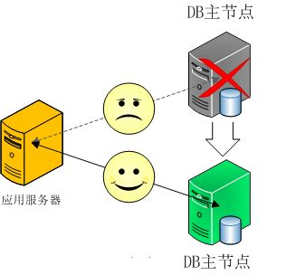

[[toc]]

# 主从复制
------------------------

主从复制是一个简单的数据库同步备份的集群技术

*   在数据库集群中要明确知道谁是主服务器，主服务器只有一台
*   从服务器要知道自己的数据源也就是知道自己的主服务器是谁
*   --master用来确定主服务器，--slave和--source 来控制从服务器



### 1.1 主服务器 [#](#t11.1 主服务器)

master.conf

```bash
dbpath=E:\ms\master
port=1000
master=true
```


master.bat

```bash
mongod --config master.conf
```


### 1.2 从服务器 [#](#t21.2 从服务器)

slave.conf

```bash
dbpath=E:\p\slave
port=1001
slave=true
source=127.0.0.1:1000
```


slave.bat

```js
mongod --config slave.conf
rs.slaveOk();
```


### 1.3 主从复制的其它设置项 [#](#t31.3 主从复制的其它设置项)

*   -only 从节点-> 指定复制某个数据库默认是复制全部数据库
*   -slavedelay 从节点-> 设置主数据库同步数据的延迟(单位是秒)
*   -fastsync 从节点-> 以主数据库的节点快照为节点启动从数据库
*   -autoresync 从节点->如果不同步则重新同步数据库
*   -oplogSize 主节点->设置oplog的大小(主节点操作记录存储到local的oplog中)

### 1.4 利用shell动态添加和删除主节点 [#](#t41.4 利用shell动态添加和删除主节点)

登录从服务器

```js
use local;
show collections;
db.sources.find();
//{  "host" : "127.0.0.1:8000", "source" : "main", "syncedTo" : Timestamp(1524728329, 1) }
db.sources.insert({host:'127.0.0.1:8000'});//挂载主节点
db.sources.remove({host:'127.0.0.1:8000'});//删除已经挂载的主节点
```


2\. 副本集 [#](#t52. 副本集)
----------------------

*   MongoDB复制是将数据同步在多个服务器的过程。
*   复制提供了数据的冗余备份，并在多个服务器上存储数据副本，提高了数据的可用性， 并可以保证数据的安全性。
*   复制还允许您从硬件故障和服务中断中恢复数据。

### 2.1 MongoDB复制原理 [#](#t62.1 MongoDB复制原理)

*   mongodb的复制至少需要两个节点。其中一个是主节点，负责处理客户端请求，其余的都是从节点，负责复制主节点上的数据。
*   mongodb各个节点常见的搭配方式为：一主一从、一主多从。
*   主节点记录在其上的所有操作oplog，从节点定期轮询主节点获取这些操作，然后对自己的数据副本执行这些操作，从而保证从节点的数据与主节点一致。

    

### 2.1 流程 [#](#t72.1 流程)

1.  一台活跃服务器和二个备份服务器
2.  当活跃服务器出现故障，这时集群根据权重算法推选出出活跃服务器
3.  当原来的主服务器恢复后又会变成从服务器

### 2.2 配置副本集 [#](#t82.2 配置副本集)

A服务器

```bash
dbpath=E:\repl\repl1
port=2001
replSet=group
```


B服务器

```bash
dbpath=E:\repl\repl2
port=2002
replSet=group
```


C服务器

```bash
dbpath=E:\repl\repl3
port=2003
replSet=group
```


### 2.3 初始化副本集 [#](#t92.3 初始化副本集)

*   rs.initiate() 启动一个新的副本集

*   rs.conf() 查看副本集的配置

*   rs.status() 命令

    ```js
    use admin;
    var conf=
    {
        "_id" : "group",
        "members" : [
            { "_id" : 0,  "host" : "127.0.0.1:2001"  },
            { "_id" : 1,  "host" : "127.0.0.1:2002"  },
            { "_id" : 2,  "host" : "127.0.0.1:2003"  }
        ]
    }
    rs.initiate(conf);
    rs.status();
    ```


### 2.4 高级参数 [#](#t102.4 高级参数)

*   standard 常规节点 参与投票有可能成为活跃节点
*   passive 副本节点 参与投票，但不能成为活跃节点
*   arbiter 仲裁节点 只参与投票，不复制节点，也不能成为活跃节点
*   priority 0到1000之间，0代表是副本节点，1到1000是常规节点
*   arbiterOnly:true 仲裁节点

### 2.5 读写分离操作 [#](#t112.5 读写分离操作)

一般情况下作为副本节点是不能进行数据库操作的，但是在读取密集的系统中读写分离是必要的

     rs.slaveOk();


### 2.6 Oplog [#](#t122.6 Oplog)

它被存储在本地数据库local中，会记录每一个操作。 如果希望在故障恢复的时候尽可能更多，可以把这个size设置的大一点

```js
--oplogSize 1024
use local;
 db.oplog.rs.find().limit(2);
```


3\. 分片 [#](#t133. 分片)
---------------------

在Mongodb里面存在另一种集群，就是分片技术,可以满足MongoDB数据量大量增长的需求。 当MongoDB存储海量的数据时，一台机器可能不足以存储数据，也可能不足以提供可接受的读写吞吐量。这时，我们就可以通过在多台机器上分割数据，使得数据库系统能存储和处理更多的数据。

### 3.1 分片架构图 [#](#t143.1 分片架构图)


### 3.2 片键 [#](#t153.2 片键)

路由根据片键把不同的文档保存到不同的分片中

### 3.3 分片的应用场景 [#](#t163.3  分片的应用场景)

1.  单台机器无法存储
2.  单台机器已经不能满足高并发操作
3.  想把尽可能多的数据存放到内存中提高性能

### 3.4 配置 [#](#t173.4  配置)

#### 3.4.1 创建Sharding副本集 [#](#t183.4.1 创建Sharding副本集)

```bash
mkdir E:\repl\db2001
mongod --port 2001 --dbpath=/data/db2001  --shardsvr --replSet=shard1
mkdir E:\repl/db2002
mongod --port 2002 --dbpath=/data/db2002 --shardsvr --replSet=shard1
```


```bash
# mongo localhost:2001
rs.initiate({_id: 'shard1', members: [{_id: 0, host: 'localhost:2001'}, {_id: 1, host: 'localhost:2002'}]})
rs.isMaster() #查看主从关系
```


```bash
mkdir E:\repl\db2003
mongod --port 2003 --dbpath=E:\repl\db2003  --shardsvr --replSet=shard2
mkdir E:\repl\db2004
mongod --port 2004 --dbpath=E:\repl\db2004 --shardsvr --replSet=shard2
```


```bash
# mongo localhost:2003
rs.initiate({_id: 'shard2', members: [{_id: 0, host: 'localhost:2003'}, {_id: 1, host: 'localhost:2004'}]})
rs.isMaster() #查看主从关系
```


#### 3.4.2 创建一个配置服务器 [#](#t193.4.2 创建一个配置服务器)

```bash
mkdir E:\repl\db2005
mongod --port 2005 --dbpath=E:\repl\db2005  --shardsvr --replSet=config
mkdir E:\repl\db2006
mongod --port 2006 --dbpath=E:\repl\db2006  --shardsvr --replSet=config
```


```bash
# mongo localhost:2005
rs.initiate({_id: 'config', members: [{_id: 0, host: 'localhost:2005'}, {_id: 1, host: 'localhost:2006'}]})
rs.isMaster() #查看主从关系
```


#### 3.4.2 创建路由服务器，并且连接配置服务器 [#](#t203.4.2 创建路由服务器，并且连接配置服务器)

路由器调用mongos命令

```bash
mongos --port 2006 --configdb config/localhost:2005,localhost:2006
```


#### 3.4.3 添加分片数据库 [#](#t213.4.3 添加分片数据库)

```bash
mongo localhost:2006
use admin
> db.runCommand({ addshard: 'shard1/localhost:2001,localhost:2002'})
> db.runCommand({ addshard: 'shard2/localhost:2003,localhost:2004'})
```


#### 3.4.5 在路由服务器打开数据分片功能 [#](#t223.4.5 在路由服务器打开数据分片功能)

```bash
use admin;
> db.runCommand({ enablesharding: 'school'})
> db.runCommand({ shardcollection: 'school.students', key: {name: 1}})
```


4\. 参考 [#](#t234. 参考)
---------------------

*   [configuration-options](https://docs.mongodb.com/manual/reference/configuration-options/)

