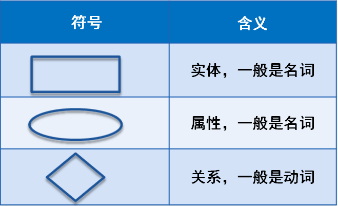
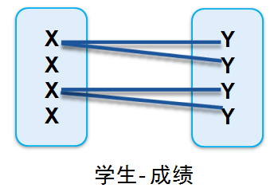

1\. 为什么需要设计数据库 [#](#t01. 为什么需要设计数据库)
------------------------------------

### 1.1 良好的数据库设计 [#](#t11.1 良好的数据库设计)

*   节省数据的存储空间
*   能够保证数据的完整性
*   方便进行数据库系统的开发

### 1.2 糟糕的数据库设计 [#](#t21.2 糟糕的数据库设计)

*   数据冗余，存储空间浪费
*   内存空间浪费
*   数据和更新插入异常

2\. 软件项目开发周期中的数据库设计 [#](#t32. 软件项目开发周期中的数据库设计)
----------------------------------------------

*   需求分析阶段: 分析客户的业务和数据处理需求
*   概要设计阶段： 设计数据库的E-R模型图，确认需求的正确和完整性
*   详细设计阶段： 应用三大范式审核数据库
*   代码编写阶段： 物理实现数据库，编码实现应用
*   软件测试阶段
*   安装部署

> 现实世界->信息世界->数据库模型图->数据库

3.设计数据库的步骤 [#](#t43.设计数据库的步骤)
-----------------------------

### 3.1 收集信息 [#](#t53.1 收集信息)

与相关人员进行交流、访谈充分了解用户需求，理解数据库需要完成的任务

### 3.2 标示实体(Entity)

标识数据库要管理的关键对象或者实体，实体一般是名词

### 3.3 标示实体的属性(Attribute)

### 3.4 标示实体之间的关系(RelationShip) 

4\. 数据库ER图 [#](#t94. 数据库ER图)
----------------------------

ER图：实体关系图，简记E-R图，是指以实体、关系、属性三个基本概念概括数据的基本结构，从而描述静态数据结构的概念模式 

### 4.1 ER图的实体（entity）

*   ER图的实体（entity）即数据模型中的数据对象，例如人、学生、音乐都可以作为一个数据对象，用长方体来表示

### 4.2 ER图的属性（attribute）

*   ER图的属性（attribute）即数据对象所具有的属性，例如学生具有姓名、学号、年级等属性，用椭圆形表示
*   属性分为唯一属性（ unique attribute）和非唯一属性
*   唯一属性指的是唯一可用来标识该实体实例或者成员的属性，用下划线表示，一般来讲实体都至少有一个唯一属性。

### 4.3 ER图的关系（relationship） [#](#t124.3 ER图的关系（relationship）)

*   ER图的关系（relationship）用来表现数据对象与数据对象之间的联系
*   例如学生的实体和成绩表的实体之间有一定的联系，每个学生都有自己的成绩表，这就是一种关系，关系用菱形来表示。

### 4.4 ER图中关联关系 [#](#t134.4 ER图中关联关系)

#### 4.4.1 1对1 (1:1) 

1对1关系是指对于实体集A与实体集B，A中的每一个实体至多与B中一个实体有关系；反之，在实体集B中的每个实体至多与实体集A中一个实体有关系。


#### 4.4.2 1对多（1:N）

1对多关系是指实体集A与实体集B中至少有N(N>0)个实体有关系；并且实体集B中每一个实体至多与实体集A中一个实体有关系。



#### 4.4.3 多对多（M:N） 

多对多关系是指实体集A中的每一个实体与实体集B中至少有M(M>0)个实体有关系，并且实体集B中的每一个实体与实体集A中的至少N（N>0）个实体有关系。


5\. 数据库设计三大范式 [#](#t175. 数据库设计三大范式)
-----------------------------------

### 5.1 不合理的表设计 [#](#t185.1 不合理的表设计)

*   信息重复
*   更新异常
*   插入异常
*   删除异常

### 5.2 三大范式 [#](#t195.2 三大范式)

#### 5.2.1 确保每列的原子性 [#](#t205.2.1  确保每列的原子性)

如果每列都是不可再分的最小数据单元，则满足第一范式


#### 5.2.2 每个表只描述一件事情 [#](#t215.2.2 每个表只描述一件事情)


#### 5.2.3 其他列都不传递依赖于主键列 [#](#t225.2.3 其他列都不传递依赖于主键列)

表中各列必须和主键直接相关，不能间接相关


5.RBAC [#](#t235.RBAC)
----------------------

*   基于角色的权限访问控制（Role-Based Access Control）
*   RBAC（Role-Based Access Control，基于角色的访问控制），就是用户通过角色与权限进行关联
*   简单地说，一个用户拥有若干角色，每一个角色拥有若干权限。这样，就构造成“用户-角色-权限-资源”的授权模型
*   在这种模型中，用户与角色之间，角色与权限之间，权限与资源之间一般是多对多的关系。
*   在RBAC中最重要的概念包括：用户(User)，角色(Role)，权限(Permission)，资源(Resource)

    ### 5.1 安全原则 [#](#t245.1 安全原则)

*   最小权限原则之所以被RBAC所支持，是因为RBAC可以将其角色配置成其完成任务所需要的最小的权限集
*   责任分离原则可以通过调用相互独立互斥的角色来共同完成敏感的任务而体现，比如要求一个计帐员和财务管理员共参与同一过帐。
*   数据抽象可以通过权限的抽象来体现，如财务操作用借款、存款等抽象权限，而不用操作系统提供的典型的读、写、执行权限

### 5.2 ER图 [#](#t255.2 ER图)


### 5.2.1 用户表 [#](#t265.2.1 用户表)

| 字段        | 字段名       | 类型         | 默认              |
| ----------- | ------------ | ------------ | ----------------- |
| id          | ID           | int(11)      |                   |
| username    | 用户名       | varchar(255) |                   |
| password    | 密码         | varchar(255) |                   |
| email       | 邮箱         | varchar(255) |                   |
| phone       | 手机号       | varchar(255) |                   |
| gender      | 性别         | tinyint      |                   |
| birthday    | 生日         | datetime     |                   |
| addresss    | 地址         | varchar(255) |                   |
| create_time | 创建时间     | datetime     | CURRENT_TIMESTAMP |
| last_login  | 上次登录时间 | datetime     |                   |
| status      | 状态         | tinyint      | 1                 |

### 5.2.2 角色表 [#](#t275.2.2 角色表)

| 字段        | 字段名   | 类型         | 默认              |
| ----------- | -------- | ------------ | ----------------- |
| id          | ID       | int(11)      |                   |
| name        | 名称     | varchar(255) |                   |
| create_time | 创建时间 | datetime     | CURRENT_TIMESTAMP |
| status      | 状态     | tinyint      | 1                 |

### 5.2.3 资源表 [#](#t285.2.3 资源表)

| 字段        | 字段名   | 类型         | 默认              |
| ----------- | -------- | ------------ | ----------------- |
| id          | ID       | int(11)      |                   |
| name        | 名称     | varchar(255) |                   |
| key         | 路径     | varchar(255) |                   |
| create_time | 创建时间 | datetime     | CURRENT_TIMESTAMP |
| status      | 状态     | tinyint      | 1                 |

### 5.2.4 用户角色表 [#](#t295.2.4 用户角色表)

| 字段    | 字段名 | 类型    |
| ------- | ------ | ------- |
| user_id | 用户ID | int(11) |
| role_id | 角色ID | int(11) |

### 5.2.5 角色资源 [#](#t305.2.5 角色资源)

| 字段        | 字段名 | 类型    |
| ----------- | ------ | ------- |
| role_id     | 角色ID | int(11) |
| resource_id | 资源ID | int(11) |

### 5.3 数据库脚本 [#](#t315.3 数据库脚本)

```sql
ALTER TABLE `categories` DROP FOREIGN KEY `fk_category_parent_id`;
ALTER TABLE `articles` DROP FOREIGN KEY `fk_article_category_id`;
ALTER TABLE `user_role` DROP FOREIGN KEY `fk_user_role_user_id`;
ALTER TABLE `user_role` DROP FOREIGN KEY `fk_user_role_role_id`;
ALTER TABLE `role_resource` DROP FOREIGN KEY `fk_role_resource_role_id`;
ALTER TABLE `role_resource` DROP FOREIGN KEY `fk_role_resource_resource_id`;

DROP TABLE `users`;
DROP TABLE `carousels`;
DROP TABLE `categories`;
DROP TABLE `articles`;
DROP TABLE `navigations`;
DROP TABLE `links`;
DROP TABLE `config`;
DROP TABLE `roles`;
DROP TABLE `user_role`;
DROP TABLE `resources`;
DROP TABLE `role_resource`;

CREATE TABLE `users` (
`id` int(11) NOT NULL AUTO_INCREMENT,
`username` varchar(255) NULL,
`password` varchar(255) NULL,
`last_login` datetime NULL DEFAULT CURRENT_TIMESTAMP,
`create_time` datetime NULL DEFAULT CURRENT_TIMESTAMP,
`status` tinyint(255) NULL DEFAULT 1,
`email` varchar(255) NULL,
`phone` varchar(255) NULL,
`gender` tinyint(255) NULL,
`birthday` datetime NULL,
`address` varchar(255) NULL,
PRIMARY KEY (`id`) 
);
CREATE TABLE `carousels` (
`id` int(11) NOT NULL AUTO_INCREMENT,
`title` varchar(255) NULL,
`url` varchar(255) NULL,
`create_time` datetime NULL DEFAULT CURRENT_TIMESTAMP,
`status` tinyint(255) NULL DEFAULT 1,
PRIMARY KEY (`id`) 
);
CREATE TABLE `categories` (
`id` int(11) NOT NULL AUTO_INCREMENT,
`title` varchar(255) NULL,
`description` varchar(255) NULL,
`keywords` varchar(255) NULL,
`create_time` datetime NULL DEFAULT CURRENT_TIMESTAMP,
`status` tinyint(255) NULL DEFAULT 1,
`parent_id` int(11) NULL,
PRIMARY KEY (`id`) 
);
CREATE TABLE `articles` (
`id` int(11) NOT NULL AUTO_INCREMENT,
`category_id` int(11) NULL,
`title` varchar(255) NULL,
`content` text NULL,
`user_id` int(255) NULL,
`keywords` varchar(255) NULL,
`create_time` datetime NULL DEFAULT CURRENT_TIMESTAMP,
`status` tinyint(255) NULL DEFAULT 1,
`pv` int(255) NULL,
PRIMARY KEY (`id`) 
);
CREATE TABLE `navigations` (
`id` int(11) NOT NULL AUTO_INCREMENT,
`title` varchar(255) NULL,
`url` varchar(255) NULL,
`create_time` datetime NULL DEFAULT CURRENT_TIMESTAMP,
`status` tinyint(255) NULL DEFAULT 1,
PRIMARY KEY (`id`) 
);
CREATE TABLE `links` (
`id` int(11) NOT NULL AUTO_INCREMENT,
`title` varchar(255) NULL,
`logo` varchar(255) NULL,
`url` varchar(255) NULL,
`create_time` datetime NULL DEFAULT CURRENT_TIMESTAMP,
`status` tinyint(255) NULL DEFAULT 1,
PRIMARY KEY (`id`) 
);
CREATE TABLE `config` (
`id` int(11) NOT NULL AUTO_INCREMENT,
`name` varchar(255) NULL,
`logo` varchar(255) NULL,
`url` varchar(255) NULL,
`create_time` datetime NULL DEFAULT CURRENT_TIMESTAMP,
`status` tinyint(255) NULL DEFAULT 1,
`keywords` varchar(255) NULL,
`description` varchar(255) NULL,
`icp` varchar(255) NULL,
`about` varchar(255) NULL,
PRIMARY KEY (`id`) 
);
CREATE TABLE `roles` (
`id` int(11) NOT NULL AUTO_INCREMENT,
`name` varchar(255) NULL,
`create_time` datetime NULL DEFAULT CURRENT_TIMESTAMP,
`status` tinyint(255) NULL DEFAULT 1,
PRIMARY KEY (`id`) 
);
CREATE TABLE `user_role` (
`user_id` int(11) NOT NULL AUTO_INCREMENT,
`role_id` int(255) NOT NULL,
PRIMARY KEY (`user_id`, `role_id`) 
);
CREATE TABLE `resources` (
`id` int(11) NOT NULL AUTO_INCREMENT,
`name` varchar(255) NOT NULL,
`key` varchar(255) NULL,
`create_time` datetime NULL DEFAULT CURRENT_TIMESTAMP,
`status` tinyint(255) NULL DEFAULT 1,
PRIMARY KEY (`id`) 
);
CREATE TABLE `role_resource` (
`role_id` int(11) NOT NULL AUTO_INCREMENT,
`resource_id` int(255) NOT NULL,
PRIMARY KEY (`role_id`, `resource_id`) 
);

ALTER TABLE `categories` ADD CONSTRAINT `fk_category_parent_id` FOREIGN KEY (`parent_id`) REFERENCES `categories` (`id`);
ALTER TABLE `articles` ADD CONSTRAINT `fk_article_category_id` FOREIGN KEY (`category_id`) REFERENCES `categories` (`id`);
ALTER TABLE `user_role` ADD CONSTRAINT `fk_user_role_user_id` FOREIGN KEY (`user_id`) REFERENCES `users` (`id`);
ALTER TABLE `user_role` ADD CONSTRAINT `fk_user_role_role_id` FOREIGN KEY (`role_id`) REFERENCES `roles` (`id`);
ALTER TABLE `role_resource` ADD CONSTRAINT `fk_role_resource_role_id` FOREIGN KEY (`role_id`) REFERENCES `roles` (`id`);
ALTER TABLE `role_resource` ADD CONSTRAINT `fk_role_resource_resource_id` FOREIGN KEY (`resource_id`) REFERENCES `resources` (`id`);
```


6.事务 [#](#t326.事务)
------------------

### 6.1 为什么需要事务 [#](#t336.1 为什么需要事务)

*   银行转账问题

*   A账户资金减少

*   B账户资金增加

    ```sql
    create database bank;
    use bank;
    create table account
    (
        name varchar(64),
        balance decimal(10,2)
    )
    insert into account(name,balance) values('张三',100);
    insert into account(name,balance) values('李四',100);
    
    update account set balance = balance - 10 where name = '张三';
    update account set balance = balance + 10 where name = '李四';
    ```

    


### 6.2 什么是事务 [#](#t346.2 什么是事务)

*   事务是作为单个逻辑工作单元执行的一系列操作
*   多个操作作为一个整体向系统提交，要么都执行，要么都不执行
*   事务是一个不可分割的工作逻辑单元

> 转账过程就是一个整体，它需要两条UPDATE语句，如果任何一个出错，则整个转账业务取消，两个账户的余额都恢复到原来的数据，确保总余额不变

### 6.3 事务的特性 [#](#t356.3 事务的特性)

*   原子性(Atomicity) 事务是一个完整的操作，事务各个部分是不可分的，要么都执行，要么都不执行
*   一致性(Consistency) 当事务完成后，数据必须处理完整的状态
*   隔离性(Isolation) 并发事务彼此隔离、独立，它不应该以任何方式依赖于其它事务
*   持久性(Durability) 事务完成后，它对数据库的修改被永久保持

### 6.4 如何创建事务 [#](#t366.4 如何创建事务)

*   开始事务 `START TRANSACTION` 或者 `BEGIN`

*   提交事务 `COMMIT`

*   回滚或者说撤销事务 `ROLLBACK`

    ```sql
    BEGIN;
    update account set balance = balance - 10 where name = '张三';
    ROLLBACK;
    ```

    

*   默认情况下，每条单独的SQL语句视为一个事务

*   关闭默认提交状态后，可手动开启、关闭事务

*   关闭/开启自动提交状态 `SET autocommit 0|1` 0关闭 1开启

> 关闭自动提交后，从下一条SQL语句开始开启新的事务，需要使用COMMIT或ROLLBACK结束该事务

