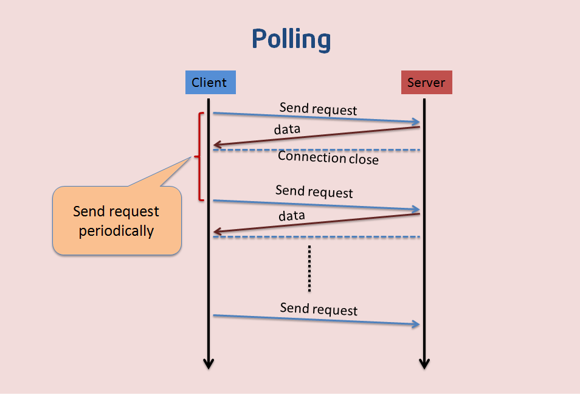

1\. HTTP的架构模式 [#](#t01. HTTP的架构模式)
----------------------------------

Http是客户端/服务器模式中请求-响应所用的协议，在这种模式中，客户端(一般是web浏览器)向服务器提交HTTP请求，服务器响应请求的资源

### 1.1. HTTP的特点 [#](#t11.1. HTTP的特点)

*   HTTP是半双工协议，也就是说，在同一时刻数据只能单向流动，客户端向服务器发送请求(单向的)，然后服务器响应请求(单向的)。
*   服务器不能主动推送数据给浏览器。

2\. 双向通信 [#](#t22. 双向通信)
------------------------

### 2.1 轮询 [#](#t32.1 轮询)

轮询是通过浏览器定时的向web服务器发送http的Get请求，服务器收到请求后，就把最新的数据发回给客户端，客户端得到数据后，将其显示出来，然后再定期的重复这一过程  server.js

```js
const Koa = require('koa');
const app = new Koa();
app.use(async function (ctx, next) {
    ctx.set('Access-Control-Allow-Origin', 'http://localhost:8000');
    ctx.body = new Date().toLocaleTimeString();
});
app.listen(8080);
```


```jsx
  <div id="clock"></div>
    <script>
            setTimeout(function () {
                let xhr = new XMLHttpRequest();
                xhr.open('GET', 'http://localhost:8080', true);
                xhr.onreadystatechange = function () {
                    if (xhr.readyState == 4 && xhr.status == 200) {
                        document.querySelector('#clock').innerHTML = xhr.responseText;
                    }
                }
                xhr.send();
            }, 1000);
    </script>
```


> ajax轮询需要服务器有很快的处理速度和资源

### 1.2 长轮询 [#](#t41.2 长轮询)

*   长轮询是服务端主动向客户端发送数据的最常见的方式之一
*   通过长轮询，客户端打开了一个到服务端的 HTTP 连接直到返回响应数据。
*   当服务端有新数据需要发送时，它会把新数据作为响应发送给客户端。


clock.html

```jsx
  <div id="clock"></div>
    <script>
        (function poll() {
                let xhr = new XMLHttpRequest();
                xhr.open('GET', 'http://localhost:8080', true);
                xhr.onreadystatechange = function () {
                    if (xhr.readyState == 4 && xhr.status == 200) {
                        document.querySelector('#clock').innerHTML = xhr.responseText;
                        poll();
                    }
                }
                xhr.send();
        })();
    </script>
```


> long poll 需要有很高的并发能力

2.websocket [#](#t52.websocket)
-------------------------------

*   [WebSockets_API](https://developer.mozilla.org/en-US/docs/Web/API/WebSockets_API) 规范定义了一个 API 用以在网页浏览器和服务器建立一个 socket 连接。通俗地讲：在客户端和服务器保有一个持久的连接，两边可以在任意时间开始发送数据。
*   HTML5开始提供的一种浏览器与服务器进行全双工通讯的网络技术
*   属于应用层协议，它基于TCP传输协议，并复用HTTP的握手通道。

### 2.1 websocket 优势 [#](#t62.1 websocket 优势)

*   支持双向通信，实时性更强。
*   更好的二进制支持。
*   较少的控制开销。连接创建后，ws客户端、服务端进行数据交换时，协议控制的数据包头部较小。

### 2.2 websocket实战 [#](#t72.2 websocket实战)

#### 2.2.1 服务端 [#](#t82.2.1 服务端)

```js
let express = require('express');
const path = require('path');
let app = express();
let server = require('http').createServer(app);
app.get('/', function (req, res) {
    res.sendFile(path.resolve(__dirname, 'index.html'));
});
app.listen(3000);
```


​    
```js
//-----------------------------------------------
let WebSocketServer = require('ws').Server;
let wsServer = new WebSocketServer({ port: 8888 });
wsServer.on('connection', function (socket) {
    console.log('连接成功');
    socket.on('message', function (message) {
        console.log('接收到客户端消息:' + message);
        socket.send('服务器回应:' + message);
    });
});
```


#### 2.2.2 客户端 [#](#t92.2.2 客户端)

```jsx
    <script>
        let ws = new WebSocket('ws://localhost:8888');
        ws.onopen = function () {
            console.log('客户端连接成功');
            ws.send('hello');
        }
        ws.onmessage = function (event) {
            console.log('收到服务器的响应 ' + event.data);
        }
    </script>
```


### 2.3 如何建立连接 [#](#t102.3 如何建立连接)

WebSocket复用了HTTP的握手通道。具体指的是，客户端通过HTTP请求与WebSocket服务端协商升级协议。协议升级完成后，后续的数据交换则遵照WebSocket的协议。

#### 2.3.1 客户端：申请协议升级 [#](#t112.3.1 客户端：申请协议升级)

首先，客户端发起协议升级请求。可以看到，采用的是标准的HTTP报文格式，且只支持GET方法。

    GET ws://localhost:8888/ HTTP/1.1
    Host: localhost:8888
    Connection: Upgrade
    Upgrade: websocket
    Sec-WebSocket-Version: 13
    Sec-WebSocket-Key: IHfMdf8a0aQXbwQO1pkGdA==


*   Connection: Upgrade：表示要升级协议
*   Upgrade: websocket：表示要升级到websocket协议
*   Sec-WebSocket-Version: 13：表示websocket的版本
*   Sec-WebSocket-Key：与后面服务端响应首部的Sec-WebSocket-Accept是配套的，提供基本的防护，比如恶意的连接，或者无意的连接。

#### 2.3.2 服务端：响应协议升级 [#](#t122.3.2 服务端：响应协议升级)

服务端返回内容如下，状态代码101表示协议切换。到此完成协议升级，后续的数据交互都按照新的协议来。

    HTTP/1.1 101 Switching Protocols
    Upgrade: websocket
    Connection: Upgrade
    Sec-WebSocket-Accept: aWAY+V/uyz5ILZEoWuWdxjnlb7E=


#### 2.3.3 Sec-WebSocket-Accept的计算 [#](#t132.3.3 Sec-WebSocket-Accept的计算)

Sec-WebSocket-Accept根据客户端请求首部的Sec-WebSocket-Key计算出来。 计算公式为：

*   将Sec-WebSocket-Key跟258EAFA5-E914-47DA-95CA-C5AB0DC85B11拼接。
*   通过SHA1计算出摘要，并转成base64字符串

    ```js
    const crypto = require('crypto');
    const number = '258EAFA5-E914-47DA-95CA-C5AB0DC85B11';
    const webSocketKey = 'IHfMdf8a0aQXbwQO1pkGdA==';
    let websocketAccept = require('crypto').createHash('sha1').update(webSocketKey + number).digest('base64');
    console.log(websocketAccept);//aWAY+V/uyz5ILZEoWuWdxjnlb7E=
    ```

    

#### 2.3.4 Sec-WebSocket-Key/Accept的作用 [#](#t142.3.4  Sec-WebSocket-Key/Accept的作用)

*   避免服务端收到非法的websocket连接
*   确保服务端理解websocket连接
*   用浏览器里发起ajax请求，设置header时，Sec-WebSocket-Key以及其他相关的header是被禁止的
*   Sec-WebSocket-Key主要目的并不是确保数据的安全性，因为Sec-WebSocket-Key、Sec-WebSocket-Accept的转换计算公式是公开的，而且非常简单，最主要的作用是预防一些常见的意外情况（非故意的）

### 2.4 数据帧格式 [#](#t152.4 数据帧格式)

WebSocket客户端、服务端通信的最小单位是[帧](https://tools.ietf.org/html/rfc6455#section-5.2)，由1个或多个帧组成一条完整的消息（message）。

*   发送端：将消息切割成多个帧，并发送给服务端
*   接收端：接收消息帧，并将关联的帧重新组装成完整的消息

#### 2.4.1 数据帧格式 [#](#t162.4.1 数据帧格式)

单位是比特。比如FIN、RSV1各占据1比特，opcode占据4比特

      0                   1                   2                   3
      0 1 2 3 4 5 6 7 8 9 0 1 2 3 4 5 6 7 8 9 0 1 2 3 4 5 6 7 8 9 0 1
     +-+-+-+-+-------+-+-------------+-------------------------------+
     |F|R|R|R| opcode|M| Payload len |    Extended payload length    |
     |I|S|S|S|  (4)  |A|     (7)     |             (16/64)           |
     |N|V|V|V|       |S|             |   (if payload len==126/127)   |
     | |1|2|3|       |K|             |                               |
     +-+-+-+-+-------+-+-------------+ - - - - - - - - - - - - - - - +
     |     Extended payload length continued, if payload len == 127  |
     + - - - - - - - - - - - - - - - +-------------------------------+
     |                               |Masking-key, if MASK set to 1  |
     +-------------------------------+-------------------------------+
     | Masking-key (continued)       |          Payload Data         |
     +-------------------------------- - - - - - - - - - - - - - - - +
     :                     Payload Data continued ...                :
     + - - - - - - - - - - - - - - - - - - - - - - - - - - - - - - - +
     |                     Payload Data continued ...                |
     +---------------------------------------------------------------+


*   FIN：1个比特 如果是1，表示这是消息（message）的最后一个分片（fragment），如果是0，表示不是是消息（message）的最后一个分片（fragment）
*   RSV1, RSV2, RSV3：各占1个比特。一般情况下全为0。当客户端、服务端协商采用WebSocket扩展时，这三个标志位可以非0，且值的含义由扩展进行定义。如果出现非零的值，且并没有采用WebSocket扩展，连接出错。
*   Opcode: 4个比特。操作代码，Opcode的值决定了应该如何解析后续的数据载荷（data payload）。如果操作代码是不认识的，那么接收端应该断开连接（fail the connection）
    *   %x0：表示一个延续帧。当Opcode为0时，表示本次数据传输采用了数据分片，当前收到的数据帧为其中一个数据分片。
    *   %x1：表示这是一个文本帧（frame）
    *   %x2：表示这是一个二进制帧（frame）
    *   %x3-7：保留的操作代码，用于后续定义的非控制帧。
    *   %x8：表示连接断开。
    *   %x9：表示这是一个ping操作。
    *   %xA：表示这是一个pong操作。
    *   %xB-F：保留的操作代码，用于后续定义的控制帧。
*   Mask: 1个比特。表示是否要对数据载荷进行掩码操作
    *   从客户端向服务端发送数据时，需要对数据进行掩码操作；从服务端向客户端发送数据时，不需要对数据进行掩码操作,如果服务端接收到的数据没有进行过掩码操作，服务端需要断开连接。
    *   如果Mask是1，那么在Masking-key中会定义一个掩码键（masking key），并用这个掩码键来对数据载荷进行反掩码。所有客户端发送到服务端的数据帧，Mask都是1。
*   Payload length：数据载荷的长度，单位是字节。为7位，或7+16位，或7+64位。
    *   Payload length=x为0~125：数据的长度为x字节。
    *   Payload length=x为126：后续2个字节代表一个16位的无符号整数，该无符号整数的值为数据的长度。
    *   Payload length=x为127：后续8个字节代表一个64位的无符号整数（最高位为0），该无符号整数的值为数据的长度。
    *   如果payload length占用了多个字节的话，payload length的二进制表达采用网络序（big endian，重要的位在前)
*   Masking-key：0或4字节(32位) 所有从客户端传送到服务端的数据帧，数据载荷都进行了掩码操作，Mask为1，且携带了4字节的Masking-key。如果Mask为0，则没有Masking-key。载荷数据的长度，不包括mask key的长度
*   Payload data：(x+y) 字节
    *   载荷数据：包括了扩展数据、应用数据。其中，扩展数据x字节，应用数据y字节。
    *   扩展数据：如果没有协商使用扩展的话，扩展数据数据为0字节。所有的扩展都必须声明扩展数据的长度，或者可以如何计算出扩展数据的长度。此外，扩展如何使用必须在握手阶段就协商好。如果扩展数据存在，那么载荷数据长度必须将扩展数据的长度包含在内。
    *   应用数据：任意的应用数据，在扩展数据之后（如果存在扩展数据），占据了数据帧剩余的位置。载荷数据长度 减去 扩展数据长度，就得到应用数据的长度。

#### 2.4.2 掩码算法 [#](#t172.4.2 掩码算法)

掩码键（Masking-key）是由客户端挑选出来的32位的随机数。掩码操作不会影响数据载荷的长度。掩码、反掩码操作都采用如下算法：

*   对索引i模以4得到j,因为掩码一共就是四个字节
*   对原来的索引进行异或对应的掩码字节
*   异或就是两个数的二进制形式，按位对比，相同取0，不同取1

    ```js
    function unmask(buffer, mask) {
          const length = buffer.length;
          for (let i = 0; i < length; i++) {
              buffer[i] ^= mask[i & 3];
          }
      }
    ```

    

#### 2.4.3 服务器实战 [#](#t182.4.3 服务器实战)

```jsx
const net = require('net');
const crypto = require('crypto');
const CODE = '258EAFA5-E914-47DA-95CA-C5AB0DC85B11';
let server = net.createServer(function (socket) {
    socket.once('data', function (data) {
        data = data.toString();
        if (data.match(/Upgrade: websocket/)) {
            let rows = data.split('\r\n');//按分割符分开
            rows = rows.slice(1, -2);//去掉请求行和尾部的二个分隔符
            const headers = {};
            rows.forEach(row => {
                let [key, value] = row.split(': ');
                headers[key] = value;
            });
            if (headers['Sec-WebSocket-Version'] == 13) {
                let wsKey = headers['Sec-WebSocket-Key'];
                let acceptKey = crypto.createHash('sha1').update(wsKey + CODE).digest('base64');
                let response = [
                    'HTTP/1.1 101 Switching Protocols',
                    'Upgrade: websocket',
                    `Sec-WebSocket-Accept: ${acceptKey}`,
                    'Connection: Upgrade',
                    '\r\n'
                ].join('\r\n');
                socket.write(response);
                socket.on('data', function (buffers) {
                    let _fin = (buffers[0] & 0b10000000) === 0b10000000;//判断是否是结束位,第一个bit是不是1
                    let _opcode = buffers[0] & 0b00001111;//取一个字节的后四位,得到的一个是十进制数
                    let _masked = buffers[1] & 0b100000000 === 0b100000000;//第一位是否是1
                    let _payloadLength = buffers[1] & 0b01111111;//取得负载数据的长度
                    let _mask = buffers.slice(2, 6);//掩码
                    let payload = buffers.slice(6);//负载数据

                    unmask(payload, _mask);//对数据进行解码处理

                    //向客户端响应数据
                    let response = Buffer.alloc(2 + payload.length);
                    response[0] = _opcode | 0b10000000;//1表示发送结束
                    response[1] = payload.length;//负载的长度
                    payload.copy(response, 2);
                    socket.write(response);
                });
            }

        }
    });
    function unmask(buffer, mask) {
        const length = buffer.length;
        for (let i = 0; i < length; i++) {
            buffer[i] ^= mask[i & 3];
        }
    }
    socket.on('end', function () {
        console.log('end');
    });
    socket.on('close', function () {
        console.log('close');
    });
    socket.on('error', function (error) {
        console.log(error);
    });
});
server.listen(9999);
```


